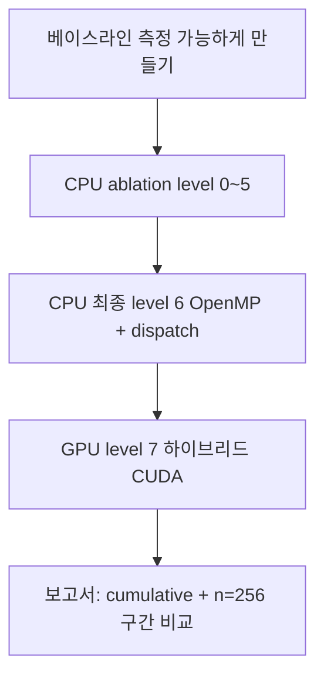

# 01. 과제 정의 및 문제 정의

## 1. PA01 과제 요구사항

### 제출·환경

- **반드시 Jetson Nano**에서 실행·검증한 결과 (노트북 로컬 실행 결과 제출 불가)
- 보고서: **핵심 결과 위주**, **PDF 최대 6페이지**

### 보고서 필수 포함 (단일 함수 `score_all()`)

| 번호 | 내용 |
|------|------|
| 1 | **CPU 레벨 고속화** — 단일 스레드 관점 캐시·중복 연산·할당 + (실습에서) OpenMP |
| 2 | **GPU 레벨 고속화** — CUDA 커널, shared memory/전송 최소화 논의 |
| 3 | **비교 분석** — baseline vs CPU vs GPU, `chrono` ms, 하드웨어 관점 설명 |

### PA02와의 경계 (보고서에서 혼동 방지)

| | PA01 | PA02 |
|--|------|------|
| 범위 | `score_all()` **하나** | `fast_correlative_scan_matcher` **모듈 전체**, 함수 2개+ |
| 수정 | `score_all.cpp` (+ CMake/CUDA) | 병목 함수 직접 선정·프로파일링 |
| `fast_matcher.cpp` | 과제상 **로직 유지** | 전체 파이프라인 설계 |

---

## 2. 시스템·패키지 맥락

### 실습 아키텍처 (요약)

```
[로컬 PC] --핫스팟--> [Gateway 112.171.196.32] --> [Jetson 192.168.0.104]
                                                          |
                                                    Docker student_19
                                                          |
                                              ROS Master 192.168.0.106 (조교)
```

- **Docker**: `dustynv/ros:melodic-ros-base-l4t-r32.7.1`, `--runtime nvidia`, `-network host`, `/data` 마운트
- **패키지**: `cartographer_parallel` — Fast Correlative Scan Matcher 일부만 분리

### 핵심 파일 구조

```
cartographer_parallel/
├── launch/cartographer_parallel_with_bag.launch  # bag 재생 + 노드
├── src/fast_correlative_node.cpp                 # ROS 구독/발행
├── src/fast_matcher.cpp                          # score_all 호출 (PA01에서 미수정)
└── src/score_all.cpp                             # ★ 과제 타겟
```

---

## 3. `score_all`이 하는 일 (문제 정의)

### 함수 시그니처·역할

```cpp
void score_all(const std::vector<unsigned char>& grid, int w, int h,
               const std::vector<int>& px, const std::vector<int>& py,
               const std::vector<int>& cx, const std::vector<int>& cy,
               std::vector<float>* score);
```

- **입력**: 2D 격자 지도 `grid` (row-major), 스캔 셀 좌표 `px/py`, 위치 후보 오프셋 `cx/cy`
- **출력**: 후보마다 [0,1] 점수 `score[i]`

### 수식 (후보 `i`, 스캔 점 `j`)

\[
\text{score}[i] = \frac{1}{255 \cdot p} \sum_{j=0}^{p-1} \text{grid}[y_{ij} \cdot w + x_{ij}]
\]

- \(x_{ij} = px_j + cx_i\), \(y_{ij} = py_j + cy_i\)
- 맵 밖이면 해당 \(j\)는 **0** (기여 없음)

### 병목 (왜 최적화 대상인가)

| 요인 | 설명 |
|------|------|
| 연산량 | 이중 루프 **O(n × p)** — 후보 `n`, 스캔 점 `p` (~1081) |
| 메모리 | `grid[y*w+x]` **랜덤 접근** → 캐시 미스, Jetson 메모리 대역폭 한계 |
| 호출 빈도 | bag 1회(~96.4s)에 **수만 회** 호출 |
| 호출 패턴 | **`n=4` 다수**, **`n=256` 소수이나 시간의 ~95%** (베이스라인 로그 분해) |

### 원본 baseline 루프 (level 0)

```cpp
for (int i = 0; i < n; ++i) {
  int sum = 0;
  for (int j = 0; j < p; ++j) {
    const int x = px[j] + cx[i];
    const int y = py[j] + cy[i];
    if (x >= 0 && x < w && y >= 0 && y < h) {
      sum += grid[y * w + x];
    }
  }
  (*score)[i] = static_cast<float>(sum) / (255.0f * static_cast<float>(p));
}
```

**문제 정의 한 줄 (보고서 서두용):**

> SLAM 스캔 매칭에서 위치 후보별 지도 일치 점수를 계산하는 `score_all`은 후보×스캔 이중 루프와 격자 랜덤 읽기로 CPU 시간이 집중되므로, **동일 점수를 유지한 채** 메모리 접근·병렬화(CPU/GPU)로 호출당 지연을 줄이는 것이 목표이다.

---

## 4. 해결 접근 (전략 타임라인)



| 단계 | 목표 | 산출물 |
|------|------|--------|
| 환경 | Jetson에서 bag 1회 완주 + `[score_all]` 로그 | `pa01_baseline_*` |
| CPU | 강의 기법별 효과 측정 → 유효 기법만 level 6에 통합 | `pa01_opt*_summary.txt` |
| GPU | n≥64 CUDA, n=4 CPU 유지 (런치 비용 회피) | `pa01_opt7_gpu_*` |
| 비교 | **cumulative(ms)** 우선, avg는 calls 증가 시 misleading | `07_COMPARISON_FOR_REPORT.md` |

---

## 5. 측정 지표 정의 (보고서에서 명시할 것)

| 지표 | 의미 | 주의 |
|------|------|------|
| `elapsed` | 해당 **한 번** `score_all` 호출의 함수 내부 시간 | n, p에 따라 크게 다름 |
| `cumulative` | bag 재생 동안 `score_all` **누적 CPU 시간 합** | SLAM wall time ≠ |
| `avg ms/call` | cumulative / call_count | 최적화 후 **call 수 증가** 가능 → 단독 비교 부적절 |
| `work_units` | n×p | 병목 규모 설명용 |
| `path` | n4 / omp_cand / interchange / **cuda** | 어떤 경로로 처리했는지 |

**공정 비교 원칙:** 동일 bag, `ns:=student_19`, `ROS_IP=192.168.0.104`, 가능하면 `uptime` load 낮을 때, summary의 **`opt=` / `level=`** 가 빌드와 일치하는지 확인.
