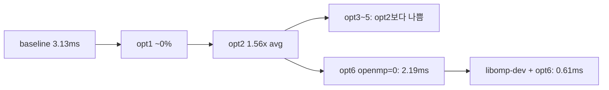

# 05. CPU 레벨 고속화 (level 0~6)

## 1. 설계 개요

- **한 파일:** `score_all.cpp` + `CMakeLists.txt`의 `PA01_OPT_LEVEL`
- **Jetson:** `catkin_make -DPA01_OPT_LEVEL=N` — 코드 복붙 없이 레벨만 변경
- **점수:** 모든 level 동일 수식 `sum(grid)/(255·p)`, 경계 밖 0

---

## 2. 단계별 기법 표

| Level | 태그 | 기법 | 강의 연결 | Jetson 기대 |
|-------|------|------|-----------|-------------|
| 0 | `baseline` | 원본 i-j 이중 루프 | — | 3.128 ms/call |
| 1 | `opt1_licm` | `inv_denom=1/(255·p)` 루프 밖 | LICM | ~0% |
| 2 | `opt2_loop_interchange` | j 바깥 / i 안쪽 + `sums[]` | 캐시, px/py 재사용 | **~36% avg↓** |
| 3 | `opt3_prefetch` | opt2 + `__builtin_prefetch` | 메모리 latency | opt2 대비 불리 |
| 4 | `opt4_branchless` | in-bounds 비트 마스크 | 분기 비용 | opt2 대비 불리 |
| 5 | `opt5_all_cpu` | 2+3+4 통합 | — | opt2 대비 불리 |
| 6 | `opt6_best` | LICM + 교환 + **OpenMP** + **dispatch** | 병렬 (4코어) | **CPU 최종** |

**level 6 채택·기각 (실험 근거):**

| 채택 | 기각 |
|------|------|
| LICM | prefetch (opt3) |
| 루프 교환 (작은 n) | branchless만 (opt4) |
| n≥64 → OpenMP 후보 병렬 | opt5 전체 조합 |

---

## 3. Jetson 측정 명령 (공통)

```bash
cd /root/catkin_ws
catkin_make -DPA01_OPT_LEVEL=N
source devel/setup.bash

export RUN=opt2_loop_interchange   # 단계별 이름
export ROS_IP=192.168.0.104

roslaunch cartographer_parallel cartographer_parallel_with_bag.launch ns:="student_19" \
  2>&1 | tee ~/pa01_${RUN}_run.log

grep -oE '\[score_all\].*' ~/pa01_${RUN}_run.log | tail -1 > ~/pa01_${RUN}_summary.txt
grep -oE '\[score_all\].*' ~/pa01_${RUN}_run.log > ~/pa01_${RUN}_clean.log

# 검증
head -1 ~/pa01_${RUN}_clean.log   # opt=... level=N
```

**PC 수집:**

```bash
ssh jetson-nano-19 "docker exec student_19 cat /root/pa01_${RUN}_summary.txt" \
  > ~/SME2009_HPDA/PA01/data/pa01_${RUN}_summary.txt
```

### level 6 추가 (OpenMP)

```bash
apt-get install -y libomp-dev
catkin_make -DPA01_OPT_LEVEL=6
source devel/setup.bash
export RUN=opt6_best
# ... 동일 roslaunch ...
```

---

## 4. summary 실측 (`data/pa01_*_summary.txt`)

| Level | opt 태그 | calls | cumulative (ms) | avg (ms/call) | vs baseline avg |
|-------|----------|-------|-----------------|---------------|-------------------|
| 0 | baseline | 27754 | 86824.5 | **3.128** | 1.00× |
| 1 | opt1_licm | 27873 | 86974.1 | 3.120 | 1.00× (~0.3%) |
| 2 | opt2_loop_interchange | 41261 | 82475.6 | **1.999** | **1.56×** |
| 3 | opt3_prefetch | 40998 | 82510.5 | 2.013 | 1.55× |
| 4 | opt4_branchless | 31631 | 85703.5 | 2.709 | 1.16× |
| 5 | opt5_all_cpu | 31672 | 85542.3 | 2.701 | 1.16× |
| 6 | opt6_best | 85260 | **52132.3** | **0.611** | **5.12×** |

### level 0 마지막 줄 (원문)

```
[score_all] opt=baseline level=0 | call=27754 | ... | cumulative=86824.499 ms / 27754 calls (avg=3.128 ms/call)
```

### level 6 마지막 줄 (원문)

```
[score_all] opt=opt6_best level=6 | call=85260 | ... | cumulative=52132.304 ms / 85260 calls (avg=0.611 ms/call) | path=n4 | openmp=1
```

---

## 5. clean.log 구간 분석 (n=4 vs n=256)

**병목:** n=256 구간이 전체 elapsed 합의 **~95%**.

| Run | n=4 횟수 | n=4 합계 ms | n=256 횟수 | n=256 합계 ms |
|-----|----------|-------------|------------|---------------|
| baseline | 19601 | 3575 | 7479 | **82952** |
| opt1 | 19632 | 3558 | 7516 | 83193 |
| opt2 | 29094 | 3536 | 11185 | **78734** |
| opt3 | 28922 | 4060 | 11027 | 78165 |
| opt4 | 22378 | 3618 | 8452 | 81794 |
| opt5 | 22423 | 3922 | 8443 | 81372 |

**통창**

1. **opt1:** 거의 변화 없음 (예상)
2. **opt2:** n=256 합계 **~5.1%↓** — 단일 기법 중 유일하게 큼
3. **opt3~5:** n=256이 opt2보다 나쁨 → level 6에서 **제외**

### opt6 path 분포 (openmp=1)

| path | 횟수 (예) | 역할 |
|------|-----------|------|
| n4 | ~58823 | n=4 전용 전개 |
| omp_cand | ~23562 | n≥64 (실질 n=256) OpenMP |
| interchange | ~1710 | 중간 n |

**n별 avg (opt6 vs opt2):**

| n | opt2 | opt6 | 개선 |
|---|------|------|------|
| 4 | ~0.122 ms | **~0.098 ms** | ~20% |
| 256 | ~7.0 ms | **~2.0 ms** | ~3.5× |

---

## 6. level 6 코드 구조 (보고서 기술용)

```cpp
const char* Dispatch(...) {
  if (n == 4) {
    ScoreN4(...);           // path=n4
    return "n4";
  }
#if PA01_HAS_OPENMP
  if (n >= 64) {            // 실질 n=256
    ScoreOmpCandidates(...); // path=omp_cand
    return "omp_cand";
  }
#endif
  ScoreInterchange(...);      // path=interchange
  return "interchange";
}
```

공통: LICM `inv_denom`, `resize`만(매번 zero assign 제거), 스택 `sums[256]`.

---

## 7. 시행착오 타임라인 (CPU)



1. 베이스라인: ROS_IP 해결 후 확보
2. opt1 빌드/로그 불일치 → 재측정 절차 확립
3. opt2: 루프 교환 + sums 버그 수정
4. opt3~5: 실험 후 **기각**
5. opt6 v1~v2: OpenMP 미링크
6. opt6 v3 + `libomp-dev`: **CPU 최종 확정**

---

## 8. opt6 이전 버전 (참고, 보고서 부록)

| | OpenMP 전 | OpenMP 후 |
|--|-----------|-----------|
| openmp | 0 | 1 |
| avg | 2.187 | 0.611 |
| cumulative | 82807 | 52132 |
| n=256 | interchange | omp_cand |

---

## 9. 보고서 CPU 섹션 체크리스트

- [ ] baseline 수치 (calls, cumulative, avg)
- [ ] ablation 1~5에서 **opt2만 유효** — 표 1개
- [ ] level 6: OpenMP + dispatch 다이어그램
- [ ] **cumulative** 86824 → 52132 ms (**1.67×**)
- [ ] n=256 구간 **~3.5×** 별도 언급
- [ ] 점수 동일성 (수식·경계 처리)
- [ ] Jetson·동일 bag·ROS_IP 명시

상세 검증: `docs/PA01_CPU_VERIFICATION.md`, 계획: `docs/CPU_OPTIMIZATION_PLAN.md`.
