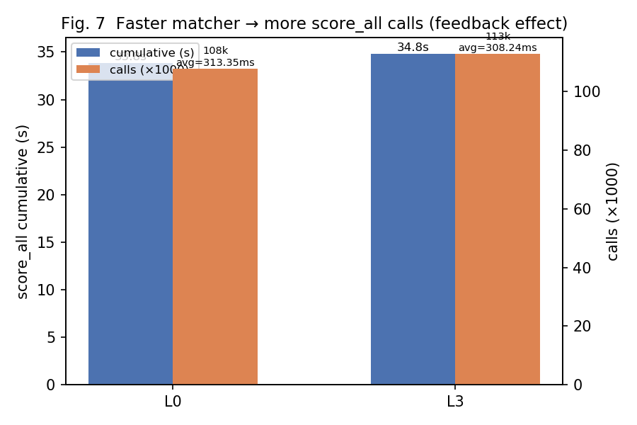
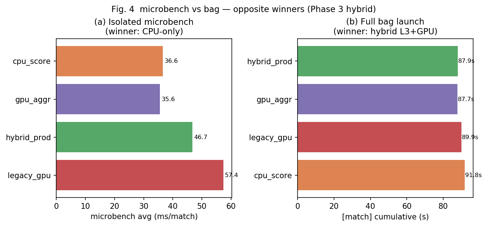

# 제2장. 실험 환경, 개발 워크플로, 측정 방법론

## 2.1 하드웨어·소프트웨어 환경

| 항목 | 사양 |
|------|------|
| **SoC** | NVIDIA Jetson Nano — 4× Cortex-A57, Maxwell 128-core GPU, 4 GB LPDDR4 |
| **소프트웨어** | CUDA 10.2, ROS Melodic, Docker `student_19` |
| **ROS Master** | `http://192.168.0.106:11311` |
| **실행 노드 IP** | `192.168.0.104` (`ROS_IP`) |
| **맵** | 467×314 cells, resolution 0.05 m/cell |
| **bag** | `scan.bag` (LiDAR `LaserScan`, p≈1081) |
| **PA01 고정** | `PA01_OPT_LEVEL=9`, `PA01_USE_GPU=ON`, `PA01_GPU_THRESHOLD=256` |
| **PA02 프로파일** | `PA02_PROFILE=ON`, `pa02_timing.h` chrono 로그 |

CPU·GPU가 LPDDR4 대역폭을 공유하는 임베디드 환경이므로, PC 벤치 결과를 그대로 이식할 수 없다. **모든 제출 수치는 Jetson Docker에서 `roslaunch`로 측정**하였다.

---

## 2.2 SSH·네트워크 구성 — `jetson-nano-19` 원클릭 접속

과제 환경은 학교 gateway 뒤에 Jetson이 위치한다. 매번 IP·포트를 입력하지 않도록 **SSH config + ProxyJump**를 설정하여, 로컬 PC 터미널에서 바로 Jetson에 접속·개발할 수 있게 하였다.

### 네트워크 토폴로지

```
[로컬 PC] ──SSH──► [rcv-gateway 112.171.196.32]
                         │
                         └──SSH──► [Jetson student_19 @ 192.168.0.104]
                                          │
                                          └──Docker──► [student_19 컨테이너]
                                                               │
                                                               └── catkin_ws / ROS node
```

### `~/.ssh/config` 설정

```
Host rcv-gateway
    HostName 112.171.196.32
    User rcv
    Port 22
    IdentityFile ~/.ssh/id_ed25519_jetson

Host jetson-nano-19
    HostName 192.168.0.104
    User student_19
    ProxyJump rcv-gateway
    IdentityFile ~/.ssh/id_ed25519_jetson
```

### 접속 확인

```bash
ssh rcv-gateway "echo gateway OK"
ssh jetson-nano-19 "echo jetson OK"
ssh jetson-nano-19 "docker exec student_19 echo container OK"
```

### Docker 진입 (일상 개발)

```bash
ssh jetson-nano-19
docker start student_19
docker exec -it student_19 /bin/bash
source ~/.bashrc   # ROS_MASTER_URI, ROS_IP, catkin devel
```

컨테이너 `~/.bashrc` 필수 항목:

```bash
export ROS_MASTER_URI=http://192.168.0.106:11311
export ROS_IP=192.168.0.104
source /opt/ros/melodic/setup.bash
source /root/catkin_ws/devel/setup.bash
```

**104 vs 106:** Master는 106, 실행 노드는 104 — 설계상 정상이다. `ROS_IP` 미설정 시 `score_all`이 호출되지 않는 사례가 PA01 초기에 다수 발생했고, 이를 문서화·자동화하여 재발을 방지하였다.

---

## 2.3 Git 기반 개발 워크플로

### 저장소 구조

Jetson catkin `src/`에 repo 전체를 `hpda` 이름으로 clone한다. (`cartographer_parallel`로 clone하면 패키지 경로가 3중으로 중첩되는 문제가 있어 README에 권장 이름을 명시했다.)

```bash
# Jetson (최초 1회)
cd ~/catkin_ws/src
git clone https://github.com/ahnsh03/SME2009-HPDA-cartographer-parallel.git hpda
cd ~/catkin_ws
catkin_make -DPA01_OPT_LEVEL=9 -DPA01_USE_GPU=ON -DPA02_PROFILE=ON -DPA02_OPT_LEVEL=0
```

### 일상 개발 루프

```
┌─────────────┐    git push     ┌─────────────┐    git pull     ┌─────────────┐
│  로컬 PC    │ ──────────────► │   GitHub    │ ◄────────────── │   Jetson    │
│  (편집·분석) │                 │   remote    │                 │ (빌드·측정) │
└─────────────┘                 └─────────────┘                 └─────────────┘
       │                                                               │
       │  docs/, scripts/, data/ 분석                                   │
       │  cartographer_parallel/ 코드 수정                               │
       └──────────────── SSH jetson-nano-19 ────────────────────────────┘
```

| 단계 | 위치 | 작업 |
|------|------|------|
| 1 | 로컬 PC | `fast_matcher.cpp`, `score_all.cpp`, CMake, scripts 수정 |
| 2 | 로컬 PC | `git commit` → `git push` |
| 3 | Jetson | `cd ~/catkin_ws/src/hpda && git pull` |
| 4 | Jetson Docker | `catkin_make -DPA02_OPT_LEVEL=N ...` → `source devel/setup.bash` |
| 5 | Jetson Docker | `scripts/pa02_bag_profile.sh pa02_lN_profile` |
| 6 | 로컬 PC | `data/pa02/` 로그 확인·`pa02_analyze_profile.py` 분석 |

### PC에서 원격 측정 자동화 (선택)

`scripts/pa02_deploy_profile.sh`는 PC에서 SSH로 소스를 Jetson에 복사·빌드·bag 실행·로그 회수까지 일괄 수행한다.

```bash
# 로컬 PC
./scripts/pa02_deploy_profile.sh pa02_l0_profile
```

내부적으로 `ssh jetson-nano-19` → `docker cp` → `docker exec catkin_make` → `pa02_bag_profile.sh` → `scp` 회수 순서로 동작한다.

### 프로젝트 전체를 보며 최적화한 이유

PA02는 `score_all` 하나가 아니라 `fast_matcher.cpp` 전체를 대상으로 한다. 따라서:

- `ref/cartographer/` upstream을 clone해 **read-only diff**로 구조 참고
- `cartographer_parallel/` launch·node·matcher·timing 헤더 **전체 연결 관계** 파악
- `scripts/` 측정·분석 파이프라인을 repo에 함께 버전 관리
- `data/pa02/`, `data/bench/` 실측 결과를 Git으로 추적

함수 파일 하나만 떼어 최적화하면, 상위 `Branch`/`Score`의 호출 패턴 변화를 놓칠 수 있다. **repo 전체를 한 워크스페이스에서 관리**한 것이 PA02 실험 재현성의 기반이 되었다.

---

## 2.4 표준 측정 파이프라인 (`pa02_bag_profile.sh`)

PA01에서 검증한 launch 기반 측정을 PA02에서 확장하였다.

```bash
# Jetson Docker 내부
cd /root/catkin_ws
catkin_make -DPA01_OPT_LEVEL=9 -DPA01_USE_GPU=ON \
  -DPA02_PROFILE=ON -DPA02_OPT_LEVEL=0
source devel/setup.bash
export ROS_IP=192.168.0.104
scripts/pa02_bag_profile.sh pa02_l0_profile
```

### 스크립트가 수행하는 일

1. **환경 기록** → `*_env.txt` (ROS_IP, CMakeCache, OPT_LEVEL)
2. **`roslaunch cartographer_parallel cartographer_parallel_with_bag.launch ns:="student_19"`** 실행
3. rosbag `\r` 줄바꿈 대응 `grep -oE`로 태그별 clean log 추출
4. 태그별 마지막 cumulative → `*_summary.txt`
5. `pa02_analyze_profile.py` → `*_bottleneck.txt` (병목 분해 보고서)

### 로그 태그

| 태그 | 위치 | cumulative 의미 |
|------|------|-----------------|
| `[make_cand]` | `score_all.cpp` | 후보 격자 1회 |
| `[MakeLowCands]` | `fast_matcher.cpp` | 스캔별 make_cand + Cand 조립 |
| `[Score]` | `fast_matcher.cpp` | score_all + sort 전체 |
| `[Branch]` | `fast_matcher.cpp` | B&B 1회 (**내부 Score 포함**) |
| `[match]` | `fast_matcher.cpp` | `MatchWithWindow` 1회 |
| `[score_all]` | PA01 | 커널 (고정) |

---

## 2.5 측정 방법론 — bag 누적 시간이 정확한 KPI인 이유

### 2.5.1 PA01에서 확립한 접근

PA01 과제에서 다수 학생이 **격리 microbench**를 만들어 `score_all` 단일 함수 속도를 비교했다. 본인은 PA01에서도 microbench를 보조 도구로 사용했으나, **최종 채택·보고서 수치는 전부 bag launch의 `[score_all]` cumulative**로 결정했다. 이 접근이 좋은 평가를 받은 이유는 다음과 같다.

1. **과제 목표가 SLAM 파이프라인 내 함수 가속**이지, 벤치마크 프로그램 가속이 아니다.
2. 함수만 빠르게 하면 상위 B&B가 **더 깊이 탐색**해 호출 수가 늘 수 있다(피드백 효과).
3. 격리 환경은 GPU H2D·OpenMP region 진입·heap 할당 등 **주변 비용을 제외**한다.

### 2.5.2 “함수만 빠르면 SLAM도 빨라진다”는 가정이 성립하지 않는 이유

#### (1) 호출 횟수 피드백

`score_all`이 빨라지면 `Branch`/`Score`가 같은 bag에서 더 많은 후보를 평가할 수 있다.

| Level | `score_all` calls | cumulative (ms) | avg (ms/call) |
|-------|------------------:|----------------:|--------------:|
| L0 (PA02 baseline) | 107,913 | 33,814 | 0.313 |
| L3 (PA02 final) | 112,852 | 34,786 | 0.308 |

calls는 **+4.6%** 늘었지만 cumulative는 **+2.9%** 수준으로 유지된다. **avg만 보면 “0.313→0.308, 거의 동일”**이지만, 호출 수 증가를 감안하면 커널 자체는 더 빨라진 것이다. 반대로 avg만으로 “몇 배 가속”을 주장하면 **호출 수 변화를 무시**하게 된다.



#### (2) microbench vs bag — 승자가 바뀌는 실측 (PA01)

| 환경 | n=256 CPU | n=256 GPU | 승자 |
|------|----------:|----------:|------|
| 연속 microbench | 0.68 ms | 1.40 ms | **CPU** |
| bag-like microbench | 0.64 ms | 0.72 ms | **CPU** |
| **실제 bag** | ~1.94 ms | **~0.86 ms** | **GPU** |

microbench는 연속 호출·warm cache·격리 환경에서 GPU launch/H2D overhead가 상대적으로 크게 잡힌다. bag는 sporadic `Match` 호출, `FastMatcher::Score` heap 할당, n=4↔256 교차, grid pointer cache 재사용이 섞인다.

#### (3) PA02 Phase 3에서 동일 패턴 재현

| variant | microbench avg (ms) | bag `[match]` (ms) |
|---------|--------------------:|-------------------:|
| **cpu_score** (GPU OFF) | **36.6** (1위) | 91,750 (4위, +4.4%) |
| **hybrid_prod** (L3+T=256) | 46.7 (3위) | **87,866** (1위) |



microbench에서 CPU-only를 채택했다면 bag KPI가 **4.4% 악화**되었다. 이는 PA01 threshold sweep에서 microbench crossover(n≥2048)와 bag 최적(T=256)이 달랐던 사례와 **동일한 구조적 함정**이다.

> **상세 분석:** crossover가 왜 2048에서 256으로 내려왔는지 → [02b_gpu_crossover_discovery.md](02b_gpu_crossover_discovery.md)  
> CPU 구현 부족이 아닌 이유 → [02c_cpu_credibility_review.md](02c_cpu_credibility_review.md)  
> OpenMP·Linux·Jetson SoC가 만드는 한계 → [02d_system_os_openmp_limits.md](02d_system_os_openmp_limits.md)

#### (4) ShrinkToFit 실험 — microbench가 오히려 misleading

| Level | microbench (ms) | bag match (ms) | best_score |
|-------|----------------:|---------------:|-----------:|
| L3 | 48.0 | 88,276 | **0.783** |
| L6 (+ShrinkToFit) | **34.2** | 92,567 | 0.777 |

microbench **승자(L6)** ≠ bag **승자(L3)**. 더 심각하게 L4 ShrinkToFit은 `best_score` **0.748**로 정확도 회귀 — microbench만 보면 발견할 수 없었다.

### 2.5.3 방법론 정리 — 타당성 판단

**사용자의 생각(“함수만 떼어 고속화하면 SLAM 전체에서 기대만큼 빨라질지 미지수”)은 타당하다.** 실제 데이터가 이를 뒷받침한다.

| 주장 | 실측 근거 |
|------|----------|
| 함수 단위 벤치 ≠ SLAM KPI | Phase 3 hybrid: microbench·bag 승자 반대 |
| 고속화 → 호출 수 증가 가능 | score_all calls L0→L3 +4.6% |
| 격리 벤치는 정확도 회귀 미검출 | ShrinkToFit: best_score 0.783→0.748 |
| bag cumulative가 최종 기준 | PA01 T=256, PA02 L3 모두 bag sweep으로 확정 |

### 2.5.4 본 연구의 측정 원칙 (3단계)

```
가설 수립
    │
    ▼
microbench (격리·후보 좁히기)     ← 보조, 채택 금지 단독 사용
    │
    ▼
bag launch (roslaunch + scan.bag)  ← KPI 확정, regression 검증
    │
    ▼
태그별 cumulative + stratum 분해  ← 병목 인과 설명
```

- **KPI 확정:** 오직 bag `[match]` cumulative
- **회귀:** `best_score`, `coarse_n`, `[score_all]` ±몇 %
- **병목 설명:** `*_bottleneck.txt` stratum (depth, n_cand, path)
- **microbench 역할:** OpenMP threshold, sort-skip 등 **방향성 가설**만 — bag에서 기각된 것은 코드에 넣지 않음

### 2.5.5 우수 PA01 과제와의 비교

교수님이 공유한 우수 PA01(`Outstanding Assignments/PA01_이승빈.pdf`)은 microbench를 체계적으로 구축하고 nvprof로 API overhead를 분석했다. 본인 PA01·PA02는 다음을 **추가**한다.

| 우수 과제 강점 | 본인 접근 |
|---------------|----------|
| 격리 벤치로 커널 특성 분석 | 동일하게 microbench 보조 사용 |
| single-call vs batch×181 비교 | bag cumulative + calls 피드백으로 확장 |
| 정확도 max_diff 검증 | PA02: `best_score` + `coarse_n` |
| — | **launch 전체 누적을 최종 KPI로 고정** (차별점) |

두 접근은 상충하지 않는다. **microbench로 원인을 분석하고, bag로 SLAM 맥락에서 검증**하는 것이 가장 완전한 방법론이다.

---

## 2.6 측정 전 품질 관리

공유 Jetson 환경에서 재현성을 위해 다음을 기록·확인했다.

```bash
# 호스트 (student_19@192.168.0.104)
w && uptime          # load average < 2.0 권장
tegrastats           # GR3D_FREQ — GPU 부하 확인

# 컨테이너
grep PA02_OPT_LEVEL build/CMakeCache.txt
grep 'PA01_GPU_DISPATCH_THRESHOLD' build/.../flags.make
```

매 run마다 `*_env.txt`에 `ROS_MASTER_URI`, `ROS_IP`, CMake 플래그를 자동 저장하여, 나중에 “어떤 빌드로 쟀는지”를 추적할 수 있게 했다.

---

## 2.7 제2장 요약

- **SSH `jetson-nano-19` + Git push/pull**로 로컬 편집·Jetson 실측을 분리하면서도 repo 전체를 일관되게 관리했다.
- **`pa02_bag_profile.sh`**로 launch→clean log→summary→bottleneck 분석까지 자동화했다.
- **bag cumulative가 SLAM 맥락의 정확한 KPI**이며, microbench 단독 채택은 PA01·PA02 모두에서 **오답**이 될 수 있음을 실측으로 보였다.
- 이 측정 철학은 PA01 좋은 평가의 핵심이었고, PA02 Phase 3 hybrid·ShrinkToFit 판단에서도 동일하게 적용했다.
