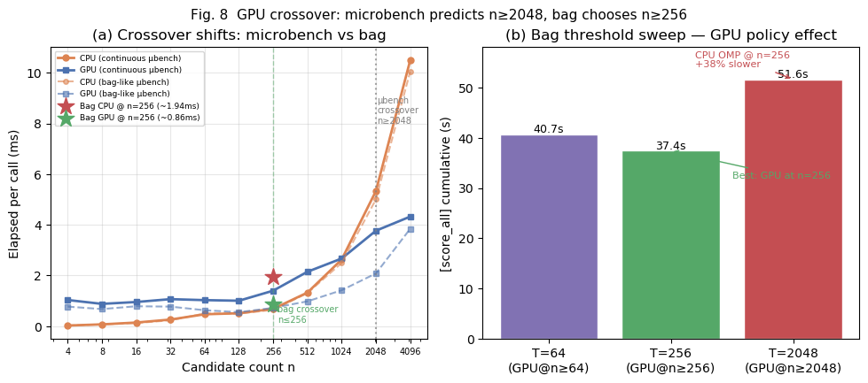
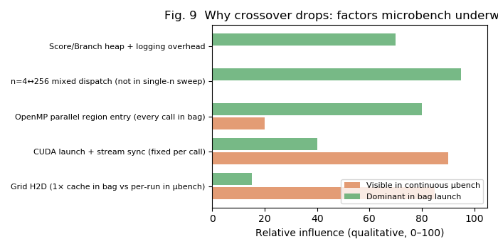

# 제2장 부록 — GPU crossover 발견: microbench는 CPU 우세, bag는 n=256부터 GPU 우세

> 본 절은 PA01·PA02 전체에 걸친 **핵심 발견**이다. 다수 학생(본인 포함)의 microbench에서는 CPU가 넓은 n 구간에서 유리했으나, `roslaunch` bag에서는 **GPU 유리 구간이 훨씬 낮은 n(≤256)** 으로 내려왔다.

---

## A.1 발견 요약

| 측정 환경 | GPU가 이기기 시작하는 n (crossover) | bag hot path n=256 승자 |
|-----------|--------------------------------------|------------------------|
| 연속 microbench (PA01) | **n ≥ 2048** | CPU (0.68 vs 1.40 ms) |
| bag-like microbench (호출 1회씩) | **n ≥ 512** (n=256은 여전히 CPU) | CPU (0.64 vs 0.72 ms) |
| **실제 bag launch** | **n ≥ 256 (threshold ≤ 256)** | **GPU (~0.86 vs ~1.94 ms)** |

**한 줄:** microbench가 “GPU 쓰려면 후보 2048개 이상”이라고 예측했지만, SLAM bag에서는 **후보 256개(coarse 단계)** 부터 GPU dispatch가 KPI상 정답이었다.

---

## A.2 실측 데이터

### A.2.1 연속 microbench — n 스윕 (`pa01_bench_20260531_080435_sweep.csv`)

동일 `score_all`에 대해 n만 바꿔 **연속 반복** 측정:

| n | CPU (ms) | GPU (ms) | winner |
|--:|---------:|---------:|--------|
| 4 | 0.022 | 1.030 | cpu |
| 64 | 0.467 | 1.025 | cpu |
| 128 | 0.507 | 1.001 | cpu |
| **256** | **0.681** | **1.398** | **cpu** |
| 512 | 1.323 | 2.145 | cpu |
| 1024 | 2.629 | 2.668 | tie |
| **2048** | 5.332 | **3.766** | **gpu** |
| 4096 | 10.489 | **4.322** | **gpu** |

→ **crossover ≈ n=2048**. n=256에서 GPU는 CPU의 **2.0× 느림**.

이 결과는 수업에서 다수 학생이 공유한 패턴과 일치한다: **후보 수를 늘려도 microbench에서는 CPU가 거의 전 구간에서 유리**하거나, GPU 이득이 매우 늦게 나타난다.

### A.2.2 bag-like microbench — OpenMP 진입 비용 반영 (`pa01_baglike_20260531_112002_sweep.csv`)

연속 루프 대신 **호출 1회씩** 평균 (`--baglike`). crossover가 2048→512로 내려왔지만:

| n | CPU (ms) | GPU (ms) | winner |
|--:|---------:|---------:|--------|
| **256** | **0.641** | **0.720** | **cpu** (근소) |
| 512 | 1.302 | **0.977** | gpu |

→ bag에 가깝게 만들어도 **n=256은 여전히 CPU 승**. 실제 bag와 불일치.

### A.2.3 실제 bag — n=256 구간 (`PA01_ADDITIONAL_EXPERIMENTS`)

| 환경 | n=256 CPU | n=256 GPU | 승자 |
|------|----------:|----------:|------|
| 연속 microbench | 0.68 ms | 1.40 ms | CPU |
| bag-like microbench | 0.64 ms | 0.72 ms | CPU |
| **실제 bag (L8 omp / L7 cuda)** | **~1.94 ms** | **~0.86 ms** | **GPU** |

**승자가 뒤집혔다.** microbench와 bag-like 모두 CPU를 가리켰지만, launch에서는 GPU가 **2.3× 빠름**.

### A.2.4 bag threshold sweep — 정책 수준에서 crossover 확인 (`pa01_opt9_threshold_sweep.csv`)

`PA01_GPU_THRESHOLD`만 바꿔 동일 bag 1회씩:

| threshold | n=256 path | n=256 avg (ms) | score_all cumulative (s) |
|----------:|------------|---------------:|-------------------------:|
| 64 | cuda (38,070 calls) | 0.842 | 40.7 |
| **256** | **cuda (38,089 calls)** | **0.754** | **37.4** ← 최소 |
| 2048 | **omp_cand** (23,642 calls) | 1.894 | 51.6 |

- threshold **≤256**: coarse hot path(n=256) 전부 **CUDA** → cumulative **~37–41 s**
- threshold **2048**: n=256이 **OpenMP CPU**로 처리 → cumulative **51.6 s (+38%)**

bag KPI 관점 crossover: **“n≥256이면 GPU”** (threshold=256). microbench가 예측한 **2048**과 **8배 차이**.

---

## A.3 원인 분석 — 왜 crossover가 내려왔나

### (1) GPU 고정 비용의 상쇄 방식이 다르다

GPU `score_all` 호출마다 발생하는 비용:

- `cudaMemcpyAsync` (px, py, cx, cy)
- kernel launch + `cudaStreamSynchronize`
- (최초 1회) grid H2D

**연속 microbench:** 매 iteration이 “새 호출”처럼 동작해 **고정 비용이 매번** elapsed에 잡힌다. n=256일 때 연산량(256×1081) 대비 고정 비용이 커서 GPU가 1.4 ms로 패배.

**실제 bag:**

- `score_all_cuda.cu`의 `UploadGrid()` **pointer cache** — 동일 grid면 H2D **생략**
- sporadic 호출이지만 **동일 map**이므로 grid는 device에 상주
- n=256일 때 **연산(랜덤 grid 읽기 병렬화)** 이 고정 비용을 상쇄

→ microbench는 grid cache 이점을 **과소평가**하고, launch는 **과대평가(고정비)** 했다.

### (2) CPU(OpenMP) 쪽이 bag에서 오히려 느려진다

> CPU 구현이 부족해서인지, 구조적 한계인지에 대한 별도 검토: [02c_cpu_credibility_review.md](02c_cpu_credibility_review.md)

microbench 연속 루프에서도 `#pragma omp parallel for`는 **호출마다 parallel region에 진입**한다. “warmup”은 스레드 풀 예열일 뿐 region 재진입 비용을 없애지 않는다.

bag에서 CPU가 더 느려지는 추가 요인:

| 요인 | microbench | bag |
|------|------------|-----|
| n=4 ↔ n=256 **교차 호출** | 단일 n만 스윕 | 70% calls는 n=4, 96% elapsed는 n=256 |
| `FastMatcher::Score` heap 할당 | 없음 | 매 Match마다 vector alloc |
| 로깅 (`[score_all]` chrono) | 있음 | 있음 + ROS/다른 태그 |
| 메모리 locality | 연속 호출로 cache warm | scan 간격·다른 모듈 간섭 |

결과: bag에서 n=256 CPU가 microbench 0.64 ms → **~1.94 ms**로 **3× 가까이 악화**. GPU n=256은 0.72 ms → **~0.86 ms**로 거의 유지.

→ **CPU 쪽이 bag에서 더 많이 나빠지면서** crossover가 내려온 것이다.

### (3) bag의 n 분포 — “단일 n 스윕”이 못 보는 것

PA01 bag `score_all` stratum:

| n | 호출 비율 | elapsed 비중 |
|---|----------|-------------|
| 4 | ~71% | ~4% |
| **256** | **~27%** | **~96%** |

정책 결정 질문은 “n=4096에서 누가 이기나”가 아니라:

> **“bag 전체에서 n=256 coarse를 GPU로 보낼 것인가?”**

microbench는 n=2048까지 CPU가 이기므로 “GPU 불필요”로 오판하기 쉽다. bag는 **실제 존재하는 n=256**에서 GPU가 2× 빠르다.

### (4) 시스템 KPI는 per-call latency가 아니다

threshold=2048일 때 n=256 **per-call** omp 1.89 ms vs cuda 0.75 ms 차이가 bag cumulative에서 **51.6 s vs 37.4 s**로 증폭된다. 동시에:

- GPU policy → B&B가 더 진행 → `score_all` **calls 증가** 가능
- 그럼에도 cumulative는 **더 줄어듦** (PA01 L7: calls 4.8× 증가, cumulative 2× 감소)

→ **per-call microbench 승자 ≠ cumulative bag 승자**가 구조적으로 성립한다.

### (5) PA02에서 동일 패턴 재확인

Phase 3 hybrid: microbench 1위 `cpu_score`(36.6 ms) → bag 4위(+4.4%). microbench는 **Match 함수만** 연속 호출하고, bag는 **Score orchestration + Branch + GPU dispatch 혼재**를 포함한다.

---

## A.4 다른 학생들과의 비교 — 왜 같은 microbench에서 같은 결론이 나왔나

| 공통점 | 결과 |
|--------|------|
| 동일 Jetson, 동일 `score_all` 수식 | GPU 고정 비용 > n=256 연산 이득 (μbench 기준) |
| 격리 벤치 표준 관행 | n 스윕 → crossover 보고 |
| CPU OpenMP 4코어 | n≤1024 구간 CPU 압도 |

**본인의 차별점:** microbench 결과를 **최종 정책으로 채택하지 않고**, bag threshold sweep으로 **정책을 뒤집었다** (T=256).

다수가 “microbench에서 CPU가 이기니 GPU는 n≥2048에서만”이라고 보고서에 쓴 반면, 본인은:

1. microbench로 **커널 특성·고정 비용**을 분석하고
2. bag에서 **crossover가 2048→256으로 이동**함을 실측하고
3. **KPI(cumulative)** 로 GPU hybrid를 확정했다

---

## A.5 보고서용 문단 (복붙)

> 연속 microbench n 스윕에서 GPU는 n≥2048부터 CPU를 앞지르았고, n=256에서는 CPU(0.68 ms)가 GPU(1.40 ms)보다 2.0× 빠르게 측정되었다. 이는 다수 동료의 실험과 일치하였다. 그러나 동일 빌드로 `roslaunch` bag을 재생하면 n=256 구간에서 CPU OpenMP(~1.94 ms)와 GPU CUDA(~0.86 ms)의 승자가 **뒤집혔고**, `PA01_GPU_THRESHOLD` bag sweep에서 threshold≤256(GPU @ n=256)이 cumulative 37.4 s로 최소, threshold=2048(CPU @ n=256)은 51.6 s(+38%)였다. 원인은 (i) bag에서 grid H2D pointer cache로 GPU 고정 비용이 상쇄되는 것, (ii) sporadic 호출·n 교차·주변 heap 할당으로 CPU OpenMP per-call 비용이 microbench 대비 3× 가까이 증가하는 것, (iii) bag hot path가 실제로 존재하는 n=256이지 n=2048이 아닌 것으로 분석한다. 따라서 microbench crossover는 **커널 분석용**으로만 사용하고, **GPU dispatch 정책은 bag cumulative로 확정**하였다.

---

## A.6 “마이크로벤치(microbenchmark)”라는 이름의 뜻

별도 질문에 대한 답:

### 왜 “마이크로”인가

성능 공학에서 벤치마크는 크기에 따라 구분된다.

| 용어 | 측정 단위 | 예 |
|------|----------|-----|
| **Microbenchmark** | **작은 코드 단위** (함수·루프·커널 하나) | `score_all`만 10만 번 호출 |
| Macrobenchmark | 응용 프로그램 전체 | SLAM 전체 경로 1회 |
| System benchmark | OS·런타임 포함 전체 시스템 | SPEC CPU, TPC |

**“마이크로(micro)”** = 그리스어로 “작은”. **프로그램 전체가 아니라 작은 단위를 떼어 내어** 측정한다는 뜻이다.

### 왜 함수를 떼어 측정하는가

1. **인과 분석** — 느린 함수 하나만 격리해 최적화 효과를 분리
2. **반복성** — 동일 입력으로 수천·수만 번 반복, 통계적 평균
3. **공정 비교** — CPU vs GPU를 **동일 입력·동일 호출 횟수**로 맞춤
4. **개발 속도** — ROS launch 없이 초 단위로 iteration

### 한계 (본 연구에서 확인한 것)

마이크로벤치는 이름 그대로 **“작은 세계”** 를 본다. SLAM launch의 다음 요소는 기본적으로 **포함되지 않는다**:

- 상위 모듈 호출 패턴 (`Branch`/`Score`)
- 호출 수 피드백 (빨라지면 더 많이 호출)
- grid·buffer **세션 간 재사용**
- n=4와 n=256 **혼합 분포**
- 정확도 회귀 (`best_score`)

그래서 본인은 microbench를 **“마이크로 = 작은 단위 분석 도구”** 로만 쓰고, **매크로(전체 파이프라인)에 가까운 bag launch cumulative**를 KPI로 삼았다. 이 둘을 혼동하면 crossover가 2048에서 256으로 바뀌는 현상을 놓친다.

### 관련 용어

| 용어 | 관계 |
|------|------|
| Kernel benchmark | GPU 커널만 측정 — microbenchmark의 GPU 버전 |
| Unit benchmark | 소프트웨어 테스트의 “단위”와 유사 — 함수 단위 |
| Integration benchmark | 여러 모듈 연결 — bag launch에 가까움 |
| Roofline model | microbenchmark로 메모리/연산 한계 추정 |

**정리:** “마이크로벤치”는 함수를 떼어 내는 측정 방식 자체를 가리키는 **표준 용어**이며, 느리다/부정확하다는 뜻이 아니다. 다만 **측정 범위가 작다**는 뜻이므로, SLAM 전체 성능에는 **bag 같은 상위 측정이 보완**되어야 한다.
