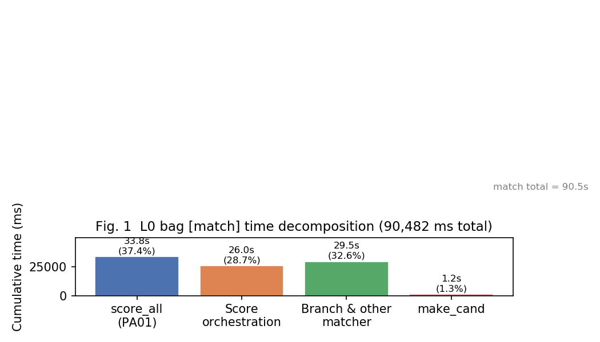

# 제3장. Phase 0 — 병목 분해 및 최적화 로드맵

## 3.1 Phase 0 목적

PA02 코드 수정 전에 **동일 bag·동일 PA01 L9 빌드**로 L0 baseline을 측정하고, 로그만으로 병목을 확정한다. “어느 루프가 무거워 보인다”는 추측이 아니라, **태그별 cumulative와 stratum 분해**가 Phase 1~3의 근거가 된다.

### 실행

```bash
catkin_make -DPA01_OPT_LEVEL=9 -DPA01_USE_GPU=ON \
  -DPA02_PROFILE=ON -DPA02_OPT_LEVEL=0 \
  -DPA01_GPU_THRESHOLD=256
scripts/pa02_bag_profile.sh pa02_l0_profile
python3 scripts/pa02_analyze_profile.py pa02_l0_profile --data-dir data/pa02
```

산출물: `data/pa02/pa02_l0_profile_{summary,env,bottleneck}.txt`

---

## 3.2 모듈 KPI 분해 (분석 A)

**질문:** bag 한 번에서 시간의 몇 %가 PA01 커널이고, 몇 %가 PA02 영역인가?

```
match_total     = [match] 마지막 cumulative
score_all_total = [score_all] 마지막 cumulative
matcher_scope   = match_total − score_all_total
```

| 항목 | ms | match 대비 |
|------|---:|-----------:|
| `[match]` | **90,482** | 100.0% |
| `[score_all]` | **33,814** | 37.4% (PA01 고정) |
| **matcher_scope** | **56,667** | **62.6%** |

**결론:** PA02가 줄일 수 있는 이론적 상한은 **~56.7 s**. `score_all`은 PA01에서 이미 −61% 완료되었으므로, 추가 이득의 천장이 matcher 오케스트레이션에 있다.



---

## 3.3 Score: 커널 vs 오케스트레이션 (분석 B)

`score_all()` 호출은 `FastMatcher::Score()` 안에서만 일어난다.

```
Score_orchestration = Σ Score.elapsed − Σ score_all.elapsed
```

| 항목 | ms | 비고 |
|------|---:|------|
| `[Score]` cumulative | 59,869 | Branch 내부 호출 포함 |
| `[score_all]` (동일 run) | 33,814 | Score 안에서 소비 |
| **Score_orchestration** | **25,955** | **Score의 43.4%** |

**포함:** 스캔별 후보 필터, `vector` 할당/복사, `std::sort`, `score_all` 호출 전후.

### Score 부하의 n_cand stratum

| n_cand | calls | elapsed 합 (ms) | avg (ms/call) | 해석 |
|--------|------:|----------------:|--------------:|------|
| **3840** | 2,110 | **41,445** | 19.6 | coarse 초기 scoring (match당 ≈1회) |
| **4** | 74,147 | **17,836** | 0.24 | B&B leaf 근처 소량·고빈도 |
| 2 | 1,788 | 390 | 0.22 | 경계 케이스 |

**결론:** Score 최적화는 **대량 1회(3840)** 와 **소량 다회(4)** 두 regime이 있다. 한쪽 stratum만 최적화하면 bag KPI에 반영되지 않을 수 있다.

---

## 3.4 Branch: depth별 부하 (분석 C)

`[Branch]` 로그의 `depth=`별 `elapsed` 합 (호출당 wall time, 내부 Score 포함):

| depth | calls | elapsed 합 (ms) | 해석 |
|-------|------:|----------------:|------|
| 0 | 11,592 | ~0.3 | leaf 반환만 |
| 1 | 20,653 | 5,258 | fine 단계 |
| 2 | 43,690 | 14,673 | |
| **3** | **2,113** | **34,679** | **coarse B&B 진입** (match 수와 유사) |

**결론:** Branch 비용은 **depth=3 (coarse)** 에 집중한다. “재귀가 많아 보인다”가 아니라 **로그 stratum**으로 확인했다.

### 중첩 타이머 주의

```
[match]  ████████████████████████████████████████  90.5 s
          ├─ MakeLowCands/make_cand  ~6.4 s
          ├─ Score (모든 호출)       ~59.9 s  ← score_all + orchestration
          │    └─ score_all          ~33.8 s  (PA01)
          └─ Branch wall time        ~54.7 s  ← 내부 Score 중복 포함

※ Branch(54.7) + 초기 Score 일부가 겹침 → 막대 합 ≠ match
```

보고서에 쓸 문장:

> `[match]` 90.5 s 중 `[score_all]` 33.8 s(37.4%)를 제외한 **56.7 s**를 matcher 오케스트레이션으로 측정하였고, 그 안에서 Score_orchestration **26.0 s**, Branch depth=3 stratum **34.7 s**(elapsed 합)을 로그 분해로 확인하였다.

---

## 3.5 make_cand / MakeLowCands (분석 D)

| 태그 | cumulative (ms) | match 대비 | calls |
|------|----------------:|-----------:|------:|
| `[make_cand]` | 1,216 | 1.3% | 31,755 |
| `[MakeLowCands]` | 6,365 | 7.0% | 2,117 |

hot path: `grid_span=16×16` → `n_added=256` (31,599 calls, 1,210 ms).

**결론:** `make_cand` 단독은 KPI에서 작다. Phase 1 대상인 이유는 **side effect 없는 첫 검증 타깃**이기 때문이다 (impact 순서가 아님).

---

## 3.6 Bottleneck → Solution 표 (보고서용)

| Bottleneck | Root Cause | Solution (Phase) |
|------------|------------|------------------|
| Score_orchestration 26 s | 스캔마다 cand 전체 스캔, vector 재할당 | 1-pass scan bucket + buffer reuse (**Phase 3**) |
| Branch depth=3 35 s | child vector 매번 할당, empty quadrant 미스킵 | thread_local child buffer, bounds skip (**Phase 2**) |
| make_cand 1.2 s | vector growth realloc | `reserve` + OMP threshold sweep (**Phase 1**) |
| score_all 34 s | PA01 완료 | **고정** (GPU hybrid T=256) |

---

## 3.7 Phase 로드맵 확정

| Phase | 함수 | 선행 실험 | 적용 후 검증 |
|-------|------|-----------|--------------|
| **0** | 전 태그 | §3.2~3.5 | `*_bottleneck.txt` |
| **1** | `make_cand` | span sweep | `[make_cand]`↓, `[score_all]` 동일 |
| **2** | `Branch` | depth 분포 | depth=3 `[Branch]`↓ |
| **3** | `Score` | hybrid sweep | `Score_orchestration`↓, `[score_all]` 동일 |

---

## 3.8 L0 baseline 스냅샷

`pa02_l0_profile_summary.txt` (2026-05-31):

| 태그 | cumulative (ms) | calls |
|------|----------------:|------:|
| match | 90,482 | 2,117 |
| score_all | 33,814 | 107,913 |
| Score | 59,869 | 78,275 |
| Branch | 54,743 | 78,275 |
| MakeLowCands | 6,365 | 2,117 |
| make_cand | 1,216 | 31,755 |

이 수치가 이후 모든 Phase의 **회귀 기준선**이다.
