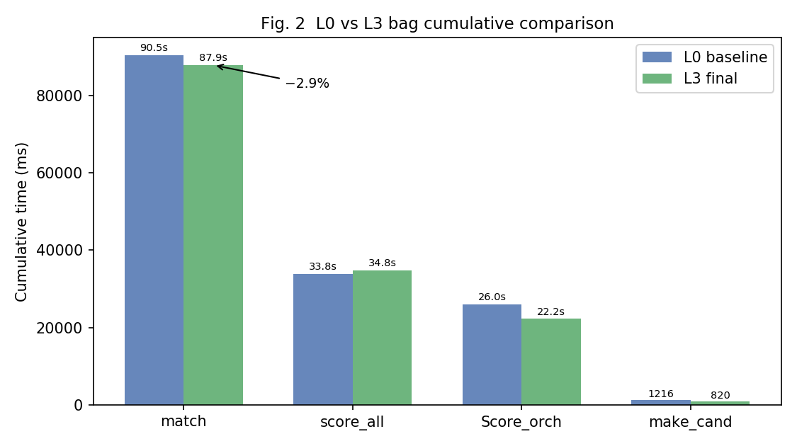
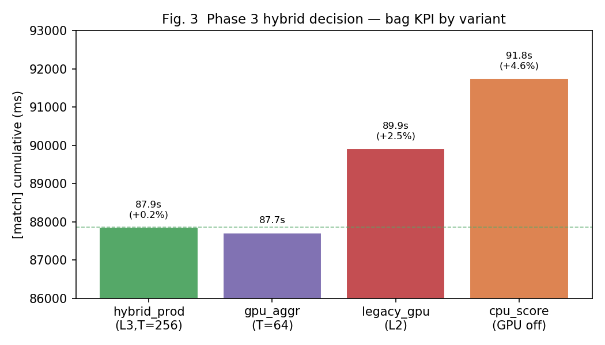

# 제5장. Phase 3 — Score 파이프라인 및 Hybrid 결정

> 최종 채택: `PA02_OPT_LEVEL=3` + PA01 L9 GPU `T=256`

---

## 5.1 Phase 3 목표

Phase 0에서 Score_orchestration **25,955 ms (Score의 43%)** 를 확인했다. L0 `Score()`는 스캔마다 `cand` 전체를 선형 스캔해 해당 스캔 후보만 모은 뒤, 매번 새 `vector`를 할당하고 `score_all`을 호출한다.

**목표:** 1-pass scan bucket + buffer reuse로 orchestration을 줄이되, `[score_all]` regression 없이 유지.

---

## 5.2 [L3] Score scan-bucket 구현

### Before (L0~L2)

```cpp
for (size_t s = 0; s < scans.size(); ++s) {
  std::vector<int> ids, cx, cy;   // 매 스캔 heap alloc
  for (size_t i = 0; i < cand->size(); ++i) {
    if ((*cand)[i].scan == static_cast<int>(s)) { ... }
  }
  score_all(..., cx, cy, &score);
}
std::sort(cand->begin(), cand->end(), ...);
```

복잡도: 스캔 수 × 후보 수 선형 스캔 + 스캔당 vector alloc.

### After (L3)

```cpp
static thread_local std::vector<std::vector<int>> buckets;
static thread_local std::vector<int> cx, cy;
static thread_local std::vector<float> scores;

// 1-pass: cand를 scan index로 bucket
for (size_t i = 0; i < n_cand; ++i)
  buckets[cand[i].scan].push_back(i);

for (size_t s = 0; s < scans.size(); ++s) {
  if (buckets[s].empty()) continue;   // empty scan skip
  cx.resize(nb); cy.resize(nb);
  // bucket → cx/cy 채우기 → score_all 1회
}
std::sort(...);
```

**개선 포인트:**
- cand 전체 스캔 **1회** (기존: 스캔마다 전체 스캔)
- `thread_local` buffer reuse (heap alloc 감소)
- empty scan skip

---

## 5.3 L3 bag 프로파일 결과

| 지표 | L0 | L3 | 변화 |
|------|-----|-----|------|
| `[match]` cumulative | 90,482 ms | **87,866 ms** | **−2.9%** |
| Score_orchestration | 25,955 ms | **22,235 ms** | **−14.3%** |
| `[Score]` cumulative | 59,869 ms | 57,075 ms | −4.7% |
| `[score_all]` cumulative | 33,814 ms | 34,786 ms | +2.9% (회귀 없음) |
| `best_score` | 0.783 | 0.783 | 동일 |
| `coarse_n` | 3840 | 3840 | 동일 |



---

## 5.4 CPU vs GPU 역할 분해

PA02에 “GPU 코드를 추가하지 않았다”는 오해가 있을 수 있다. 실제로는:

| 계층 | 역할 | CPU | GPU |
|------|------|-----|-----|
| PA01 `score_all` | correlative score | n=4 `ScoreN4` | **n≥256 CUDA (~81%)** |
| PA02 L3 | bucket·sort·Branch | **CPU orchestration** | 없음 |

bag `score_all` path 분해 (`pa02_analyze_score_paths.py`):

| path | elapsed 비중 | 대표 n |
|------|-------------:|--------|
| **cuda** | **~81%** | 256 |
| n4 | ~18% | 4 |
| interchange | <1% | 2 |

**GPU는 PA01 hybrid가 담당**하고, PA02는 그 위의 CPU 오케스트레이션을 줄였다.

---

## 5.5 Phase 3 hybrid 결정 실험

### 질문

L3 CPU bucket + GPU kernel **hybrid**가 맞는가? CPU-only / GPU threshold 변경이 더 나은가?

### 후보 정의

| variant | PA02 | GPU threshold | 의미 |
|---------|------|---------------|------|
| **hybrid_prod** | **L3** | **256** | CPU bucket + hybrid kernel (**채택**) |
| cpu_score | L3 | 999999 | CPU bucket + CUDA OFF |
| gpu_aggr | L3 | 64 | CPU bucket + GPU threshold 낮춤 |
| legacy_gpu | L2 | 256 | 구 Score orch + hybrid kernel |

### bag KPI

| variant | match (ms) | Δ vs hybrid | score_all (ms) | best_score |
|---------|----------:|------------:|---------------:|-----------:|
| **hybrid_prod** | **87,866** | — | **34,786** | 0.783 |
| gpu_aggr | 87,713 | −0.2% | 35,152 | 0.783 |
| legacy_gpu | 89,926 | +2.3% | 35,043 | 0.783 |
| cpu_score | 91,750 | **+4.4%** | **47,325** | 0.783 |



### score_all path — cpu_score가 느린 이유

| variant | n=256 dominant path | n=256 elapsed |
|---------|---------------------|---------------|
| hybrid_prod | **cuda (81%)** | ~28.2 s |
| cpu_score | **omp_cand (88%)** | ~41.7 s |

CPU-only(T=999999)는 coarse(n=256)를 GPU 대신 OpenMP로 처리 → score_all **+36%**.

---

## 5.6 microbench vs bag — Phase 3에서 재확인

| variant | microbench avg (ms) | bag match (ms) | microbench 순위 | bag 순위 |
|---------|--------------------:|---------------:|:---------------:|:--------:|
| cpu_score | **36.6** | 91,750 | **1** | 4 |
| gpu_aggr | 35.6 | 87,713 | 2 | 2 |
| hybrid_prod | 46.7 | **87,866** | 3 | **1** |
| legacy_gpu | 57.4 | 89,926 | 4 | 3 |


**microbench만으로 CPU-only를 채택했다면 bag KPI 4.4% 악화.**

이는 PA01에서 microbench crossover(n≥2048)와 bag 최적(T=256)이 달랐던 교훈과 **동일 패턴**이다 (제2장 §2.5).

### microbench가 misleading한 구조적 이유

1. **연속 호출** — GPU launch/H2D overhead가 매번 부담
2. **주변 비용 제외** — Branch 재귀, heap alloc, 로깅 없음
3. **n 분포 단순** — bag는 n=4(75k calls) + n=256(31k calls) 혼재
4. **grid cache** — bag에서 `UploadGrid()` pointer cache hit

---

## 5.7 미구현 항목과 ROI

| 미적용 | 이유 |
|--------|------|
| PA02 batch GPU Score | coarse는 이미 scan당 CUDA; orchestration ~22 s는 커널로 안 줄어듦 |
| Branch sibling OMP (GPU) | concurrent CUDA singleton unsafe |
| GPU threshold 64 | bag ±0.2%, score_all 소폭 증가 |
| CPU-only (T=999999) | bag +4.4% |

L3 bucket이 orchestration을 ~26 s → ~22 s로 이미 줄였다. 남은 22 s에 batch GPU를 얹어도 match KPI 수백 ms 미만 기대 → 구현 ROI 낮음.

---

## 5.8 Phase 3 결론

1. **L3 scan-bucket** — Score_orchestration −14%, match −2.9%
2. **hybrid(L3 + T=256) 채택** — CPU orchestration과 PA01 GPU kernel 둘 다 필요
3. **microbench 단독 채택 금지** — bag에서 검증된 variant만 production
4. **PA01 GPU hybrid 변경 없음** — threshold 256 유지

### 최종 production 빌드

```bash
catkin_make -DPA01_OPT_LEVEL=9 -DPA01_USE_GPU=ON -DPA02_OPT_LEVEL=3 \
  -DPA02_MAKE_CAND_OMP_MIN=512 -DPA02_BRANCH_OMP_MIN=999999 \
  -DPA01_GPU_THRESHOLD=256
```
