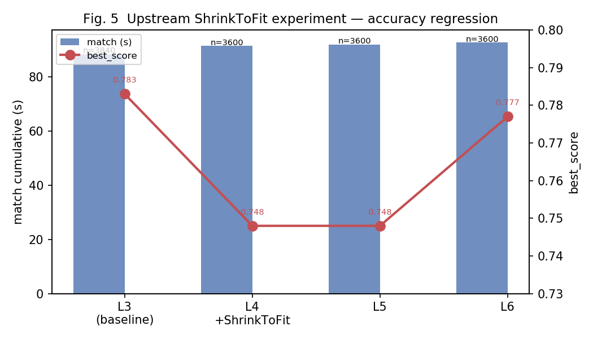

# 제6장. upstream Cartographer 참고 실험

> 참고: `ref/cartographer/cartographer/mapping/internal/2d/scan_matching/fast_correlative_scan_matcher_2d.{h,cc}`  
> 방법: read-only diff → PA02_OPT_LEVEL 누적 → Jetson bag + microbench

---

## 6.1 upstream 참고 방법

```bash
# PC (catkin 밖)
git clone --depth 1 https://github.com/cartographer-project/cartographer.git ref/cartographer
```

upstream `fast_correlative_scan_matcher_2d.cc`의 핵심 구조:

| upstream 함수 | 역할 |
|--------------|------|
| `ShrinkToFit` | discrete scan in-bounds와 linear window 교집합으로 탐색창 축소 |
| `GenerateLowestResolutionCandidates` | 정확한 후보 수 선계산 + `reserve` |
| `ScoreCandidates` | inline CPU loop (GPU 없음) |
| `BranchAndBound` | 재귀 B&B |

**주의:** upstream은 probability grid + in-map 후보만 생성한다. 과제 `score_all`은 **OOB 포인트를 0으로 처리**해 partial overlap 후보가 높은 점수를 낼 수 있다. 이 semantics 차이가 ShrinkToFit 실패의 근본 원인이다.

---

## 6.2 실험 E1 — ShrinkToFit (기각)

### 가설

Cartographer처럼 local window와 per-scan map in-bounds 교집합을 쓰면 invalid 후보를 줄여 matcher_scope가 감소한다.

### 구현

`MakeBounds` local path에 upstream `ShrinkToFit` 동일 로직 적용 (L4, 1차 sweep).

### 결과 (`data/bench/pa02_structural_20260531_155906`)

| Level | match (ms) | coarse_n | **best_score** | score_all (ms) |
|-------|----------:|---------:|---------------:|---------------:|
| L3 (baseline) | 88,276 | **3840** | **0.783** | 35,518 |
| L4 (+ShrinkToFit) | 91,326 | **3600** | **0.748** | 44,296 |
| L5 | 91,853 | 3600 | 0.748 | 45,319 |
| L6 | 92,567 | 3600 | 0.777 | 49,112 |



### 분석

- **coarse_n 3840→3600:** 탐색 공간 축소 (grid_span 16×16 → 16×15 등)
- **best_score 0.783→0.748:** 최적 pose 후보가 탐색 공간 밖으로 제거됨
- upstream semantics ≠ 과제 scoring semantics

### microbench vs bag (재확인)

| Level | microbench (ms) | bag match (ms) | best_score |
|-------|----------------:|---------------:|-----------:|
| L3 | 48.0 | 88,276 | **0.783** |
| L4 shrink | 43.3 | 91,326 | **0.748** |
| L6 | **34.2** | 92,567 | 0.777 |

→ microbench **승자(L6)** ≠ bag **승자(L3)**. **정확도 회귀는 bag에서만 검출.**

### 결론

**기각 및 revert** (`a2b2ca1`). 보고서에 실패 실험을 포함하면 “upstream을 무조건 복사하지 않았다”는 설득력이 높아진다.

---

## 6.3 실험 E2 — exact reserve (미채택)

### 가설

upstream `GenerateLowestResolutionCandidates`처럼 scan×bounds로 정확한 후보 개수를 `reserve`하면 vector growth/realloc 제거.

### 결과 (`data/bench/pa02_structural_20260531_161217`)

| Level | match (ms) | Δ vs L3 | best_score |
|-------|----------:|--------:|-----------:|
| L3 | 88,145 | — | 0.783 |
| L4 | 88,461 | +0.4% | 0.783 |
| L5 | 88,673 | +0.6% | 0.783 |

microbench: L3 46.8 → L5 43.8 ms (−6.4%) — **bag에 미반영.**

### 결론

**안전하지만 bag KPI 채택 이득 없음** — L3 유지. 코드는 L4에 존재하나 production 미채택.

---

## 6.4 실험 E3 — Score sort-skip + presize (미채택)

- `cand->size() <= 1`일 때 `std::sort` 생략
- L3 bucket path에서 `scores.resize(nb)` 사전 할당

L5: match 88,673 ms (+0.6% vs L3). Branch −1% 정도 있으나 match KPI 악화 방향 (노이즈).

### 결론

**미채택.**

---

## 6.5 upstream 대비 — 왜 더 못 줄였나

| upstream 구조 | 본인 L3 | 추가 이식 시 |
|---------------|---------|-------------|
| `ScoreCandidates` inline CPU | scan별 `score_all` + **GPU hybrid** | inline → GPU 상실 |
| `ShrinkToFit` | local ±lin 고정 | **정확도 회귀** (E1) |
| `PrecomputationGrid` probability | uchar max-pool | grid 빌드 1회, bag 영향 미미 |
| batch candidate reserve | L2 추정 reserve | exact reserve bag 무변화 (E2) |

**score_all(PA01)이 이미 −61%** — matcher_scope ~53 s 중 orchestration·B&B 구조가 잔여 한계.

---

## 6.6 upstream 실험에서 얻은 교훈

1. **참고 ≠ 복사** — semantics 차이를 bag regression으로 검증해야 한다.
2. **microbench 개선 ≠ bag KPI** — E2, ShrinkToFit 모두 해당.
3. **정확도 지표 필수** — `best_score` 하락은 속도 개선보다 우선 기각 사유.
4. **실패 실험의 가치** — E1은 “왜 L3가 최적인가”를 설명하는 강한 근거.

### 재현

```bash
./scripts/pa02_structural_sweep.sh
```

산출:
- `data/bench/pa02_structural_20260531_155906/` — E1 ShrinkToFit (실패 기록)
- `data/bench/pa02_structural_20260531_161217/` — E2/E3
