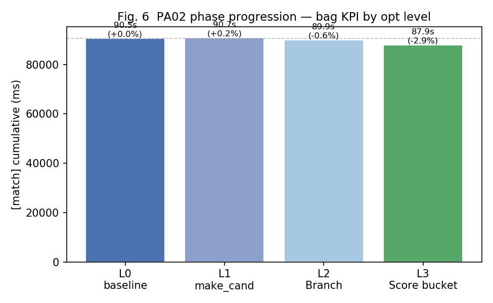

# 제7장. 종합 및 결론

## 7.1 PA02 최적화 누적 결과

| Level | 내용 | match (ms) | Δ vs L0 | best_score | score_all (ms) |
|------:|------|----------:|--------:|-----------:|---------------:|
| L0 | baseline | 90,482 | — | 0.783 | 33,814 |
| L1 | make_cand reserve | ~90,701 | +0.2% | 0.783 | ~33,8xx |
| L2 | Branch buffer reuse | 89,926 | −0.6% | 0.783 | ~35,043 |
| **L3** | **Score scan-bucket** | **87,866** | **−2.9%** | **0.783** | 34,786 |



### 구간별 기여

| 구간 | L0 → L3 변화 | 해석 |
|------|-------------|------|
| Score_orchestration | 25,955 → 22,235 ms (−14%) | Phase 3 핵심 이득 |
| `[make_cand]` | 1,216 → 820 ms | 절대량 작음 |
| `[score_all]` | 33,814 → 34,786 ms | PA01 고정, 회귀 없음 |
| matcher_scope | 56,667 → 53,080 ms | −6.3% |

---

## 7.2 PA01 + PA02 전체 그림

| 구분 | 대상 | bag 기준 개선 | 핵심 수단 |
|------|------|--------------|-----------|
| **PA01** | `score_all` 커널 | −61% (86,824→33,814 ms) | CPU N4/OMP + CUDA hybrid T=256 |
| **PA02** | matcher 오케스트레이션 | −2.9% (90,482→87,866 ms) | make_cand + Branch + Score bucket |

**왜 PA02가 PA01보다 덜 줄었나?**

1. PA02 시작 시 **score_all(37%)은 이미 최적화 완료** — 상한은 matcher_scope ~56.7 s
2. 잔여 비용은 B&B 재귀·sort·호출 구조 등 **커널 바깥 구조**
3. 추가 GPU 레이어(batch Score, Branch OMP)는 **ROI 낮거나 unsafe**

end-to-end 관점: PA01이 커널 병목을 제거했고, PA02가 오케스트레이션을 추가로 줄였다. **두 과제는 상호 보완**이며, PA02 이득이 작아 보이는 것은 **이미 PA01에서 큰 부분을 가져갔기 때문**이다.

---

## 7.3 측정 방법론 — 본 연구의 기여

### PA01·PA02 공통 원칙

| 원칙 | 내용 |
|------|------|
| KPI | bag launch 태그별 **cumulative** (벽시계 아님) |
| 확정 | microbench 후보 선별 → **bag로 최종 채택** |
| 회귀 | PA01: max_diff / PA02: best_score, coarse_n |
| 피드백 | 함수 가속 → 호출 수 증가 가능 (Fig. 7) |

### PA01 좋은 평가의 핵심

다수 학생이 microbench 중심이었으나, 본인은 **`roslaunch` + bag replay에서 `[score_all]` cumulative**를 정확한 성능 지표로 사용했다. PA02에서 `[match]`로 KPI를 확장하고, Phase 3 hybrid·ShrinkToFit에서 **동일 원칙이 올바른 선택이었음**을 재확인했다.

### 방법론적 타당성 (실측 요약)

| 가설 | 검증 |
|------|------|
| 함수만 빠르면 SLAM도 빨라진다? | **아니오** — calls +4.6%, hybrid vs cpu_score bag +4.4% |
| microbench 승자 = bag 승자? | **아니오** — Phase 3, ShrinkToFit, PA01 threshold 모두 반례 |
| bag cumulative가 정확한 KPI? | **예** — SLAM 맥락·호출 피드백·정확도 회귀 동시 검증 |

### GPU crossover 발견 (PA01 핵심)

다수 학생과 마찬가지로 연속 microbench에서는 **n≤1024 전 구간 CPU 우세**, crossover **n≥2048**이었다. 그러나 bag launch에서는 n=256부터 GPU가 CPU OpenMP보다 **~2.3× 빠르고**, threshold sweep으로 **GPU @ n≥256**이 cumulative 최소(37.4 s vs 51.6 s)임을 확인했다. microbench가 예측한 crossover와 bag 실측 crossover가 **8배(2048 vs 256) 어긋난다** — 이 발견이 bag KPI를 고수한 근거다 ([02b_gpu_crossover_discovery.md](02b_gpu_crossover_discovery.md)).

---

## 7.4 개발 환경 기여

| 항목 | 내용 |
|------|------|
| SSH | `jetson-nano-19` ProxyJump 원클릭 접속 |
| Git | PC 편집 ↔ GitHub ↔ Jetson `git pull` 동기화 |
| 자동화 | `pa02_bag_profile.sh`, `pa02_analyze_profile.py`, sweep scripts |
| upstream | `ref/cartographer` read-only 참고 |
| 데이터 | `data/pa02/`, `data/bench/` Git 추적으로 재현성 확보 |

repo 전체를 한 워크스페이스에서 관리한 것이, 함수 단위 최적화가 아닌 **matcher 모듈 전체 관점**의 실험을 가능하게 했다.

---

## 7.5 채택 / 미채택 요약

### 채택

```bash
catkin_make -DPA01_OPT_LEVEL=9 -DPA01_USE_GPU=ON -DPA02_OPT_LEVEL=3 \
  -DPA02_MAKE_CAND_OMP_MIN=512 -DPA02_BRANCH_OMP_MIN=999999 \
  -DPA01_GPU_THRESHOLD=256
```

### 미채택 (의도적)

| 항목 | 이유 |
|------|------|
| ShrinkToFit (E1) | best_score 0.783→0.748 회귀 |
| exact reserve (E2), Score tweak (E3) | bag KPI ±0.6% 무변화 |
| CPU-only score (T=999999) | bag +4.4% (microbench는 승) |
| Branch sibling OMP (GPU build) | concurrent CUDA unsafe |
| batch GPU Score | ROI 낮음 |

---

## 7.6 한계 및 향후 연구

1. **matcher_scope 잔여 ~53 s** — B&B 구조 자체가 ceiling; 근본적 돌파는 알고리즘 변경 필요
2. **run간 calls 수 변동** — SLAM 비결정성; 동일 호출 수 가정 비교 불가
3. **정확도 검증 범위** — best_score sanity check이지 전역 SLAM RMSE 아님
4. **PA01 미완** — CUDA shared memory tiling (PA01 보고서 향후 과제)
5. **Ablation 실험** — sort 생략·B&B 즉시 반환 등 인과 실험은 Phase 0b로 설계만 완료

---

## 7.7 결론 (6문장)

1. PA02는 PA01 L9 GPU hybrid를 고정한 채, bag 프로파일로 확정한 **make_cand·Score·Branch** 오케스트레이션을 최적화하였다.
2. 모듈 KPI `[match]` cumulative는 **90,482 → 87,866 ms(−2.9%)** 이고, `best_score=0.783`·`coarse_n=3840`은 유지되었다.
3. Score scan-bucket(L3)이 Score_orchestration **−14%** 로 가장 큰 기여를 했다.
4. Phase 3 hybrid 실험에서 **microbench 승자(CPU-only) ≠ bag 승자(hybrid)** 를 재확인하여, bag cumulative 기반 측정 방법론의 타당성을 뒷받침했다.
5. upstream ShrinkToFit은 정확도 회귀로 **기각**하였으며, upstream 참고는 semantics 검증 없는 무조건 이식이 아님을 보였다.
6. SSH·Git·자동화 스크립트로 구축한 **재현 가능한 실험 파이프라인**이 PA01·PA02 전체 최적화의 기반이었다.
