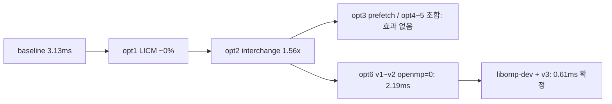
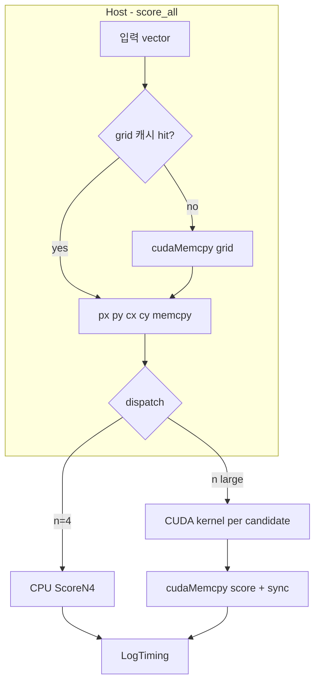

# 🚀 [실시간 데이터 해석] PA01 과제 수행 가이드

본 가이드는 NVIDIA Jetson Nano 환경에서 구글 Cartographer 기반의 2D LiDAR SLAM 스캔 매칭 연산을 CUDA로 가속화하는 PA01 과제의 전반적인 시스템 아키텍처와 실행 파이프라인을 다룹니다.

## 🏛️ 1. 실습 환경 아키텍처 및 접속 경로

실습 환경은 보안과 자원 격리를 위해 다중 홉(Multi-hop) 및 도커(Docker) 기반으로 구축되어 있습니다.

- **네트워크 터널링 계층**
    1. **로컬 노트북 (Local PC):** 보안 포트 차단을 막기 위해 반드시 스마트폰 모바일 핫스팟(테더링)을 이용해 외부망에 접속합니다.
    2. **관문 서버 (Gateway Proxy):** 외부망에서 연구실 내부망으로 진입하기 위한 마스터 PC(`rcv@112.171.196.32:22`)입니다.
    3. **젯슨 나노 (Host OS):** 내부망 사설 IP(`192.168.0.104`)에 위치한 할당 보드(`student_19`)입니다.
- **도커 컨테이너 계층 (`student_19` 컨테이너 최초 생성 구조)**
    - `sudo docker run -it --runtime nvidia --network host -v /home/dataset/:/data --name "student_19" dustynv/ros:melodic-ros-base-l4t-r32.7.1`
    - **`-runtime nvidia`**: 컨테이너가 젯슨 나노의 물리적 GPU(Maxwell) 자원을 직접 제어할 수 있도록 권한을 부여하는 핵심 설정입니다. (CUDA 연산 필수)
    - **`-network host`**: 호스트의 네트워크를 공유하여 ROS 노드 간 통신 지연(Latency)을 최소화합니다.
    - **`v /home/dataset/:/data`**: 젯슨 보드의 특정 경로를 도커 내부의 `/data/`로 마운트하여, 기가바이트(GB) 단위의 `.bag` 센서 데이터와 원본 코드를 보존하고 공유합니다.

## 🌐 2. 내부 통신 구조 (ROS Network)

도커 컨테이너 내부의 `~/.bashrc`에는 분산 처리를 위한 핵심 환경변수가 설정되어 있습니다.

- **`export ROS_MASTER_URI=http://192.168.0.106:11311`**
    - **의미:** ROS 생태계의 중앙 통제 서버(roscore)가 조교님 서버(`192.168.0.106`)에 위치함을 명시합니다.
    - **역할:** 조교님 서버의 Publisher가 쏘아주는 라이다 센서 데이터를 내 도커 컨테이너 내부의 Subscriber 노드가 실시간으로 수신하여 SLAM 연산을 수행하게 해주는 핵심 연결 고리입니다.

## 📦 3. `cartographer_parallel` 패키지 상세 분석

구글 Cartographer 모듈 중 연산 부하가 가장 큰 'Fast Correlative Scan Matcher'만을 분리하여 병렬 처리 실습이 가능하도록 경량화한 패키지입니다.

- **스캔 매칭(Scan Matching):** 현재 수신된 라이다 스캔 데이터와 기존 지도(Map) 사이의 최적의 일치점(x, y, yaw)을 찾기 위해 수많은 후보군을 탐색하는 작업입니다.

**📂 핵심 디렉토리 및 파일 구조**

```cpp
cartographer_parallel/
├── CMakeLists.txt        # 빌드 규칙 (C++ 및 CUDA 컴파일 설정)
├── launch/               
│   └── cartographer_parallel_with_bag.launch  # 🚀 [실행] 과제 구동용 메인 런치 파일
├── maps/                 # 사전 구축된 2D 격자 지도 (0501.yaml, 0501.pgm)
├── bags/                 # 라이다 센서 테스트 데이터 (scan.bag)
└── src/                  # 💻 핵심 C++ / CUDA 소스 코드 폴더
    ├── fast_correlative_node.cpp  # ROS 통신(토픽 구독/발행) 담당 메인 노드
    ├── fast_matcher.cpp           # 스캔 매칭 전체 파이프라인 제어 (score_all 호출)
    └── score_all.cpp              # 🎯 [과제 타겟] 위치 후보군 정렬 점수 계산 코어
```

**🎯 최적화 타겟: `score_all.cpp`**

- **병목 원인:** $N$개의 위치 후보군과 $P$개의 레이저 스캔 포인트를 이중 반복문(`for-loop`)으로 순회하며 일일이 매칭 점수를 계산하므로 연산량이 $N \times P$로 폭증합니다.
- **최적화 목표:** 이 단순/반복 연산을 1차적으로 CPU 메모리 접근 최적화 기법으로 개선하고, 2차적으로 GPU의 수많은 스레드에 분산 할당(CUDA 병렬화)하여 런타임을 획기적으로 낮춰야 합니다.

---

## 🚀 4. PA01 실전 과제 수행 파이프라인 (반복 매뉴얼)

### 📌 [Phase 1] 젯슨 나노 원격 접속

반드시 스마트폰 핫스팟 연결 후 로컬 PC 터미널에서 순차적으로 진입합니다.

```cpp
# 1. 마스터 서버 접속
ssh -p 22 rcv@112.171.196.32
# (Password: R0b0t!csV!s!0nlab)

# 2. 젯슨 나노 접속 (프롬프트 변경 후)
ssh student_19@192.168.0.104
# (Password: inha_rcv)
```

### 🐳 [Phase 2] 도커 컨테이너 진입

나만의 ROS/CUDA 독립 환경으로 들어갑니다.

```cpp
# 1. 컨테이너 구동 (이미 켜져있으면 무시됨)
docker start student_19
	  
# 2. 컨테이너 내부 터미널 진입
docker exec -it student_19 /bin/bash
```

### 💻 [Phase 3] 코드 덮어쓰기 및 빌드 (⭐️반복 구간)

로컬 PC의 Cursor IDE에서 AI와 함께 작성한 최적화 코드를 젯슨 환경에 덮어쓰고 빌드합니다.

```cpp
# 1. 타겟 파일 열기
cd /root/catkin_ws/src/cartographer_parallel/cartographer_parallel/src/
vi score_all.cpp
# (기존 코드 삭제 -> 로컬에서 복사한 코드 붙여넣기 -> :wq 저장 및 종료)

# 2. ROS 워크스페이스 빌드 적용
cd /root/catkin_ws/
catkin_make
source devel/setup.bash

방법 2
# 1. 타겟 파일 열기
cd /root/catkin_ws/src/cartographer_parallel/cartographer_parallel/src/
vi score_all.cpp
# (기존 코드 삭제 -> 로컬에서 복사한 코드 붙여넣기 -> :wq 저장 및 종료)

# 1. 파일에 덮어쓰기 모드로 입력 대기 상태 진입
cat > /root/catkin_ws/src/cartographer_parallel/cartographer_parallel/src/score_all.cpp

# 2. 이 상태에서 터미널 화면에 복사한 코드 붙여넣기 (Ctrl+Shift+V 또는 마우스 우클릭)

# 3. 붙여넣기가 끝났으면 빠져나오기 (입력 종료 신호 전송)
# 반드시 키보드에서 [ Ctrl + D ] 를 누릅니다!

# 2. ROS 워크스페이스 빌드 적용
cd /root/catkin_ws/
catkin_make
source devel/setup.bash
```

### 🚗 [Phase 4] SLAM 알고리즘 실행 및 성능 측정

작성한 코드가 잘 동작하는지 실시간 데이터를 재생하여 테스트합니다.

```cpp
# 1. 메인 런치 파일 실행
roslaunch cartographer_parallel cartographer_parallel_with_bag.launch ns:="student_19"
```

- **결과 확인:** 화면에 `[RUNNING] Bag Time...` 로그와 함께 우리가 심어둔 `std::chrono` 기반의 런타임 측정 결과(ms)가 출력되는지 확인합니다. 이 런타임 수치와 병목 해결 논리가 최종 보고서의 핵심 증빙 자료가 됩니다. (종료 시 `Ctrl + C`)

---

# 📊 [실시간 데이터 해석] PA01 & PA02 과제 평가 기준 및 로드맵

## ⚠️ [공통 필수 준수 사항]

- **실행 환경:** 반드시 **Jetson Nano(도커 컨테이너)** 내부에서 실행되고 검증된 결과여야 합니다. (노트북에서 돌린 결과 제출 불가)
- **보고서 규격:** 핵심 결과 위주로 명확하게 작성하며, **최대 6페이지 이내의 PDF 형식**으로 제출해야 합니다.

---

## 🎯 PA-01: 단일 함수 딥다이브 (수직적 최적화)

**타겟:** `score_all()` 단일 함수 (위치 후보군별 스캔 매칭 점수를 계산하는 핵심 병목 구간)

**[보고서 필수 포함 내용 및 수행 전략]**

1. **CPU 레벨 고속화:** * 단일 스레드(Single-thread) 환경에서 메모리 접근 패턴 개선(Cache Hit 극대화), 불필요한 중복 연산 제거, 불필요한 메모리 재할당 방지 등 컴퓨터 구조론적 최적화를 적용합니다.
2. **GPU 레벨 고속화 (CUDA):**
    - CPU 최적화의 한계를 극복하기 위해 `score_all` 내부의 반복문을 CUDA 커널(`__global__`)로 전환합니다.
    - 수많은 스레드에 연산을 분산하고, Shared Memory를 활용하여 글로벌 메모리 접근 지연을 숨기는(Latency Hiding) 기법을 적용합니다.
3. **비교 분석:**
    - C++ `<chrono>`를 이용해 측정한 **[원본 베이스라인 vs CPU 최적화 vs GPU 최적화]** 세 버전의 런타임(ms) 결과를 수치 및 그래프로 비교하고, 왜 이런 성능 차이가 발생했는지 하드웨어 관점에서 논리적으로 분석합니다.

---

## 🏗️ PA-02: 전체 모듈 아키텍처 설계 (수평적 최적화)

**타겟:** `fast_correlative_scan_matcher` 전체 모듈

**[보고서 필수 포함 내용 및 수행 전략]**

1. **고속화 대상 함수 선정 이유 (최소 2개 이상):**
    - *전략:* 이번에는 타겟이 주어지지 않습니다. 직접 프로파일링 도구나 `<chrono>` 타이머를 모듈 곳곳에 심어, 런타임을 가장 많이 잡아먹는 **병목 함수 2개 이상을 직접 발굴**해야 합니다. 보고서에는 수치적 근거를 바탕으로 "왜 이 함수들을 타겟으로 잡았는지"를 명시해야 합니다.
2. **각 대상 함수별 CPU / GPU 최적화 선정에 대한 타당한 이유:**
    - *전략:* 모든 코드를 GPU로 넘긴다고 무조건 빨라지지 않습니다(데이터 전송 오버헤드 발생). 찾아낸 병목 함수들의 특징을 분석하여, "이 함수는 메모리 복사 비용보다 병렬 연산 이득이 크므로 GPU로, 저 함수는 단순 순차 연산이므로 CPU 최적화로 처리했다"는 아키텍처 설계의 타당성을 증명해야 합니다.
3. **최적화 결과 및 적용:**
    - 선정한 기법(CPU or GPU)에 맞춰 코드를 실제로 리팩토링하고 정상 동작함을 확인합니다.
4. **종합 비교 분석:**
    - 모듈 전체의 실행 시간이 최적화 전/후로 얼마나 단축되었는지, 내가 설계한 CPU-GPU 협업(오버랩) 파이프라인이 의도대로 잘 작동했는지 분석합니다.

# 정리 필요. 스크랩

정말 날카로운 질문입니다! 병렬 처리 최적화 과제에서 '독립적인 실행 환경 보장'은 정확한 시간 측정(Benchmarking)을 위해 가장 중요한 전제 조건이죠. 4명이 같은 하드웨어 자원(특히 GPU와 CPU 메모리 대역폭)을 공유하기 때문에, 누군가 무거운 연산을 돌리고 있다면 내 런타임이 평소보다 훨씬 길게 측정될 수 있습니다.

다른 수강생이 젯슨 보드를 빡세게(?) 사용하고 있는지 확인하는 가장 확실한 3가지 방법을 알려드릴게요. 이 명령어들은 도커 컨테이너 내부가 아니라, **젯슨 보드 호스트(Host) 터미널(`student_19@192.168.0.104`)에서 실행**하는 것이 가장 정확합니다.

---

### 🕵️‍♂️ 1. 현재 접속 중인 사용자 확인하기 (`w` 또는 `who`)

누군가 SSH로 보드에 들어와 있는지 가장 직관적으로 확인하는 방법입니다.

Bash

#

`# 호스트 터미널에서 입력
w`

- **결과 보는 법:** 현재 로그인한 사용자의 ID(`student_18`, `student_20` 등)와 접속 시간, 그리고 현재 어떤 명령어를 치고 있는지(WHAT 열)가 뜹니다. 만약 나(`student_19`) 외에 아무도 없다면 매우 쾌적한 상태입니다.

### 📊 2. CPU 및 메모리 점유율 실시간 확인 (`htop` 또는 `top`)

접속만 해두고 아무것도 안 하는 사람도 있을 수 있으니, 실제 하드웨어 부하량을 봐야 합니다.

Bash

#

`# 호스트 터미널에서 입력
htop
# (htop이 설치되어 있지 않다면 top 입력)`

- **결과 보는 법:** * 상단의 CPU 게이지(0~100%)가 치솟아 있는지 확인합니다.
    - 리스트에서 `roslaunch`나 `cc1plus`(C++ 컴파일러) 같은 무거운 프로세스가 돌아가고 있다면, 누군가 코드를 빌드하거나 SLAM을 돌리고 있는 중입니다.
    - 확인을 끝내고 빠져나올 때는 `q` 또는 `Ctrl + C`를 누릅니다.

### 🎮 3. GPU 사용량 및 온도 확인 (`tegrastats` 또는 `jtop`)

젯슨 나노에 특화된 모니터링 도구입니다. 이번 과제는 CUDA(GPU)를 쓰기 때문에 GPU가 놀고 있는지 확인하는 것이 필수입니다.

Bash

#

`# 호스트 터미널에서 입력
tegrastats`

- **결과 보는 법:** 1초마다 시스템 상태가 한 줄씩 출력됩니다.
    - **`GR3D_FREQ 0%`**: 여기서 `GR3D`가 바로 GPU 사용량입니다. 이 수치가 0%라면 아무도 GPU 연산을 돌리고 있지 않다는 뜻입니다! (빠져나올 땐 `Ctrl + C`)

---

### 💡 정확한 런타임 측정을 위한 팁

위 방법으로 아무도 없다는 것을 확인했더라도, OS 자체의 백그라운드 작업 때문에 매 실행마다 런타임이 미세하게 달라질 수 있습니다.

따라서 **최종 보고서에 적을 시간을 측정할 때는 코드를 최소 3~5회 연속으로 실행해 보고, 그중 가장 빠른 시간(Best Time)이나 평균 시간을 기록**하는 것이 신뢰성을 높이는 방법입니다. (조교님 공지에 있던 클라썸 팀 페이지를 통해 "지금 10분만 벤치마크 돌리겠습니다!" 라고 소통하는 것도 베스트 매너입니다.)

지금 젯슨 보드에 들어가 계신다면, 위 명령어들을 쳐보고 현재 환경이 벤치마크를 돌리기에 쾌적한 상태인지 한번 진단해 보시겠어요?

## 📂 1. 리눅스 경로의 비밀: 'root' 계정과 '/' 루트 디렉토리의 차이

터미널 프롬프트에 표시된 `root@inha-desktop:/#` 문장의 의미를 해부하면 다음과 같습니다.

- **`root` (맨 앞):** 현재 로그인한 ‘사용자의 이름(계정명)’입니다. 리눅스 시스템의 모든 권한을 가진 최고 관리자를 뜻합니다.
- **`/` (콜론 뒤의 기호):** 현재 내가 서 있는 ‘디렉토리의 위치(현재 경로)’입니다. 이를 루트 디렉토리(Root Directory)라고 부르며, 파일 시스템의 최상위 뿌리를 의미합니다.

### 💡 호스트의 루트와 컨테이너의 루트는 완전히 다른가요?

**네, 완전히 독립된 가상 세계입니다.** 도커 컨테이너는 네임스페이스(Namespace)와 네임드 제어 기술을 사용하여 호스트 OS의 파일 시스템과 완전히 격리된 ‘자신만의 가상 최상위 루트(`/`)’를 가집니다. 호스트의 최상위 루트와 도커 내부의 최상위 루트는 이름만 같을 뿐 물리적으로 전혀 다른 공간입니다.

### 🔍 `cd catkin_ws`가 실패하고 `cd ~/catkin_ws`가 성공한 이유

컨테이너에 막 진입했을 때 사용자님의 위치는 컨테이너의 최상위 뿌리인 `/` 폴더였습니다.

1. **`cd catkin_ws` (상대 경로 접근):** 현재 내 위치인 최상위 루트(`/`) 바로 아래에서 `catkin_ws`라는 폴더를 찾으라는 명령어입니다. 하지만 루트 직속 아래에는 `bin`, `data`, `workspace` 등만 존재할 뿐 `catkin_ws`가 없기 때문에 에러가 발생했습니다.
2. **`cd ~/catkin_ws` (절대 경로 접근):** `~` 기호는 현재 로그인한 사용자(`root`)의 고유 방인 홈 디렉토리(Home Directory)를 뜻하며, 실제 절대 경로는 `/root`입니다. 따라서 `~`를 붙이면 파일 시스템 어디에 있든 상관없이 "최상위 루트 밑에 있는 `root` 폴더 안의 `catkin_ws`로 다이렉트 점프해라"라는 명확한 주소 지정을 의미하므로 이동에 성공한 것입니다.

---

## 📊 2. 실행하신 터미널 명령어 결과 정밀 해석 (현재 젯슨 상태 진단)

보내주신 로그를 분석한 결과, 현재 젯슨 나노 보드는 다른 사람의 방해 없이 사용자님의 베이스라인 성능을 측정하기에 "최적의 쾌적한 상태"입니다. 수치별로 증명해 드릴게요.

### ① `w` 명령어 해석 (현재 접속자 및 작업 현황)

Plaintext

`22:19:45 up 11 days, 10:57,  6 users,  load average: 0.30, 0.21, 0.18`

- **`load average: 0.30`:** 현재 시스템 부하율을 뜻합니다. 젯슨 나노는 4코어 CPU이므로 이 값이 4.0에 가까워야 100% 가동 중인 것인데, 현재 `0.30`이라는 것은 **CPU가 거의 일하지 않고 쉬고 있음**을 뜻합니다.
- **접속 세션 상황:** 현재 총 6개의 터미널 세션이 열려 있습니다. `pts/1` 세션에서 누군가 `docker exec -it student_`로 컨테이너를 구동 중이고, 다른 포트에서 `student_19` 계정(사용자님)이 모니터링 명령어를 치고 있는 흐름이 잘 보입니다.

### ② `top` 명령어 해석 (CPU 및 메모리 점유율)

Plaintext

`%Cpu(s):  1.8 us,  1.5 sy,  0.0 ni, 95.9 id
KiB Mem :  4059240 total,  1953332 used,   571600 free`

- **`95.9 id` (★ 핵심):** `id`는 Idle(유휴 상태)의 줄임말입니다. **현재 전체 CPU 자원의 95.9%가 완전히 비어있는 청정 상태**입니다.
- **`KiB Mem`:** 젯슨 나노의 물리 RAM 용량인 4GB(`4059240 total`) 중 약 1.95GB가 사용 중이며, 캐시 메모리를 제외하고도 버퍼 여유가 충분합니다.
- **`roslaunch` (PID 11726):** 백그라운드 프로세스 리스트를 보면 조교님이 켜두신 기본 `roslaunch` 마스터 모듈이 동작 중이지만, CPU를 단 1.0%만 먹고 있어 사용자님의 벤치마크 테스트에 전혀 지장을 주지 않습니다.

### ③ `tegrastats` 명령어 해석 (NVIDIA 임베디드 전용 로그)

Plaintext

`RAM 2016/3964MB ... CPU [6%@102,3%@102,4%@102,1%@102] ... GR3D_FREQ 0% (가끔 63%)`

- **`CPU [...@102]`:** 4개의 CPU 코어가 모두 가동 주파수 최하단인 **102MHz**로 뚝 떨어져서 휴식을 취하고 있습니다. (연산이 시작되면 주파수 숫자가 커집니다.)
- **`GR3D_FREQ 0%` (★ GPU 최적화 핵심 지표):** `GR3D`는 젯슨 나노 Maxwell GPU의 **3D 그래픽스/연산 엔진 가동률**을 뜻합니다. 가끔 시스템 UI나 백그라운드 자극으로 `63%` 튀는 찰나를 제외하면 **대부분 `0%`를 유지**하고 있습니다. 즉, 다른 수강생이 GPU(CUDA) 연산을 돌리고 있지 않습니다.

### 🛠️ 단계 1: 로컬 PC의 SSH Config 파일 설정 (ProxyJump 구축)

Cursor가 중계 서버를 알아서 징검다리 삼아 젯슨 나노까지 한 번에 점프(`ProxyJump`)하도록 설정해야 합니다.

1. 로컬 PC(노트북)에서 텍스트 에디터나 VS Code/Cursor를 열고 아래 경로의 파일을 엽니다.
    - **Windows:** `C:\Users\본인계정명\.ssh\config`
    - **Mac / Linux:** `~/.ssh/config` *(만약 `.ssh` 폴더나 `config` 파일이 없다면 직접 생성해 주면 됩니다. 확장자 없이 `config`라는 이름으로 만듭니다.)*
2. 파일 안에 아래 내용을 그대로 복사해서 붙여넣고 저장합니다.

```
# 1. 관문 역할을 하는 연구실 마스터 서버 (Gateway)
Host rcv-gateway
    HostName 112.171.196.32
    User rcv
    Port 22

# 2. 최종 목적지 (할당받은 19번 젯슨 나노 보드)
Host jetson-nano-19
    HostName 192.168.0.104
    User student_19
    ProxyJump rcv-gateway
```

`ssh jetson-nano-19` 명령어로 접속

# PA01 베이스라인 트러블슈팅·해결 기록 (보고서 초안용)

---

## 1. 과제 목표

- **대상:** `score_all.cpp` (Fast Correlative Scan Matcher의 핵심 병목)
- **1단계:** 원본 코드에 C++ `<chrono>` 기반 런타임 측정 추가 (점수 계산 로직·결과 불변)
- **환경:** Jetson Nano (student_19), Docker `student_19`, ROS Master `192.168.0.106`, 보드 IP `192.168.0.104`

---

## 2. 최종 성공 결과 (bag 전체 재생 후)

마지막 로그 예시:

```
[score_all] call=27800 | cumulative=87034.014 ms / 27800 calls (avg=3.131 ms/call)
Done. (bag 96.4초 재생 완료)
```

| 지표 | 값 | 해석 |
| --- | --- | --- |
| 총 호출 횟수 | **27,800회** | bag 1회 재생 동안 `score_all` 호출 누적 |
| **누적 CPU 시간** | **~87.0초** (`cumulative`) | `score_all` 내부 연산 시간 합 (벽시계 ≠) |
| **호출당 평균** | **~3.13 ms/call** (`avg`) | 베이스라인 대표값 |
| 1회 typical | ~0.177 ms, n=4, p=1081 | 후보 4개·스캔 1081점일 때 |
| 지도 | 467×314 | `grid_bytes=146638` |

**베이스라인 보고서에 쓸 한 줄 예시:**

> 원본 `score_all` (Jetson Nano, bag 96.4s): **27,800 calls**, **누적 87.03 s**, **평균 3.13 ms/call**.
> 

---

## 3. 증상별 트러블슈팅 타임라인

### 3.1 [증상 A] `roslaunch`만 돌고 `[score_all]` 로그가 전혀 없음

**관찰**

- `[RUNNING] Bag Time...`만 빠르게 출력
- `tee score_baseline.log` 후 `grep score_all` → **빈 결과**
- `grep "Loaded map"` 도 log 파일에 **없음**

**초기 가설 (일부는 오해)**

| 가설 | 판정 |
| --- | --- |
| 코드가 너무 느려서 로그 전에 종료 | ❌ 호출되면 ms 단위로 로그 출력됨 |
| chrono 코드 오류 | ❌ 이후 정상 동작으로 반증 |
| Master 106 vs 보드 104 불일치 | ❌ 분산 ROS 정상 구조 |
| `tee`가 노드 출력을 안 잡음 | △ 부분적 (아래 4절) |

**실施한 진단 (Jetson에서 직접)**

```bash
strings devel/lib/libassignment_cpu_lib.so | grep timing   # → 없음(후에 제거된 깔끔한 버전)
ldd devel/lib/cartographer_parallel/fast_correlative_node | grep assignment  # → .so 링크 OK
nm -D devel/lib/libfast_matcher_lib.so | grep score_all   # → U score_all (외부 호출 예정)
rostopic hz /student_19/scan                             # → ~40 Hz
rosnode info /student_19/fast_correlative_node           # → Subscriptions: /student_19/scan
rostopic echo /student_19/scan -n1                       # → ranges 정상
```

**중간 진단 (`/tmp/score_all_baseline.log` 실험)**

- `LOADED`만 있고 `make_cand` / `INVOKED` 없음
→ **라이브러리는 로드됐지만 `score_all()` 본문이 한 번도 실행되지 않음**
→ 원인은 `score_all` 내부가 아니라 **그 앞단(스캔 → Match 파이프라인)**

---

### 3.2 [증상 B] 빌드는 됐는데 런타임에서 매칭이 안 도는 상태

**확인된 환경 문제: `ROS_IP` 미설정**

```bash
echo $ROS_MASTER_URI   # → <http://192.168.0.106:11311>  (OK)
echo $ROS_IP           # → (비어 있음)
echo $ROS_HOSTNAME     # → (비어 있음)
```

`~/.bashrc`에는 원래:

```bash
export ROS_MASTER_URI=http://192.168.0.106:11311
source /opt/ros/melodic/setup.bash
```

만 있었고, **`ROS_IP=192.168.0.104` 없음**.

**메커니즘 (보고서용 요약)**

- ROS1은 Master(106)에 노드·토픽을 등록
- 각 머신은 **자신의 IP**를 Master/다른 노드에 알려야 TCP 연결이 안정적
- `ROS_IP`가 비어 있으면, `rostopic echo`/`hz`는 되는데 **같은 프로세스의 콜백·매칭이 안 도는** 경우가 있음 (실습 환경에서 재현)

**해결**

`~/.bashrc`에 추가 (복구 후):

```bash
export ROS_MASTER_URI=http://192.168.0.106:11311
export ROS_IP=192.168.0.104
source /opt/ros/melodic/setup.bash
source /root/catkin_ws/devel/setup.bash
```

```bash
source ~/.bashrc
```

**결과:** bag 재생 중 `[score_all] call=...` 연속 출력 → **성공**.

---

### 3.3 [부수 사건] `cat > ~/.bashrc` 실수로 bashrc 비움

**증상:** `~/.bashrc` 크기 0바이트

**복구 (되돌리기 불가, 재작성)**

```bash
cp /etc/skel/.bashrc ~/.bashrc
# 위 ROS 4줄을 맨 아래 추가
source ~/.bashrc
```

**교훈:** `cat >`는 덮어쓰기. 추가는 `cat >>` 또는 `nano`.

---

### 3.4 [증상 C] `grep`이 ROS 로그에서 안 됨

```bash
grep score_all ~/.ros/log/latest/*/fast_correlative_node*.log
# → No such file or directory
```

**이유**

1. Melodic에 **`~/.ros/log/latest` 심볼릭 링크가 없거나** 경로가 다름
2. `[score_all]`은 **`std::cerr`로 터미널에 직접 출력** → **ros 노드 로그 파일에 안 남는 경우가 많음**
3. glob 가 매칭 실패 시 grep이 “파일 없음”으로 종료

**대안 (아래 5절)**

---

## 4. 아키텍처 정리 (104 / 106)

| 항목 | IP/역할 |
| --- | --- |
| Jetson 보드 (student_19) | **192.168.0.104** — 코드·bag 실행 |
| ROS Master (조교) | **192.168.0.106:11311** — `roscore` |
| SSH 경로 | PC → Gateway `112.171.196.32` → `192.168.0.104` |

**정상:** Master는 106, 실행은 104. **과제 설계상 맞는 구성.**

---

## 5. 로그 저장 방법 (`cat`보다 나은 실습용 방법)

파일을 PC로 옮기기 어려울 때 권장 순서:

### (1) `tee` + `grep` — 가장 실용적

```bash
cd /root/catkin_ws && source devel/setup.bash
source ~/.bashrc

roslaunch cartographer_parallel cartographer_parallel_with_bag.launch ns:="student_19" \\
  2>&1 | tee ~/pa01_baseline_run.log

# bag 끝난 뒤
grep '\\[score_all\\]' ~/pa01_baseline_run.log > ~/pa01_score_all_only.log
tail -20 ~/pa01_score_all_only.log
cat ~/pa01_score_all_only.log   # 터미널에서 스크롤 복사 → PC 메모장
```

- **전체:** `pa01_baseline_run.log`
- **보고서용:** `pa01_score_all_only.log` (마지막 5~10줄 + 첫 5줄)

### (2) `script` — 터미널 세션 전체 기록

```bash
script ~/pa01_session.log
# roslaunch ...
exit
grep score_all ~/pa01_session.log
```

### (3) 마지막 줄만 요약 저장

```bash
grep '\\[score_all\\]' ~/pa01_baseline_run.log | tail -1 > ~/pa01_baseline_summary.txt
cat ~/pa01_baseline_summary.txt
```

### (4) ROS 로그에서 찾을 때 (경로가 다를 때)

```bash
ls -lt /root/.ros/log/ | head -5
# 가장 위 run 디렉터리 ID 복사 후
grep -r score_all /root/.ros/log/<그-ID>/
grep -r score_all /root/.ros/log/ 2>/dev/null | tail -20
```

`[score_all]`이 **여전히 없으면** → 애초에 stderr만 썼기 때문. **`tee` 로그가 정본.**

### (5) `cat`만 쓸 때

```bash
cat ~/pa01_score_all_only.log
```

한 번에 너무 길면 `head -5`, `tail -10` 으로 나눠 복사.

---

## 6. 측정 전: 다른 학생/부하 영향 확인 (공유 Jetson)

같은 보드·같은 Master를 쓰면 **CPU·네트워크·ROS 트래픽**에 간섭 가능.

### 6.1 CPU·메모리

```bash
uptime                    # load average (4코어 기준 4 근처면 포화)
top -bn1 | head -20       # CPU% 높은 프로세스
free -h                   # 메모리
```

### 6.2 Docker·다른 컨테이너

```bash
docker ps                 # 다른 student 컨테이너 동시 실행 여부
```

### 6.3 ROS Master上的 다른 학생

```bash
rosnode list | grep student
rostopic list | grep scan
# 예: /student_05/scan, /student_19/scan 동시 존재 → Master 공유 중
```

### 6.4 네트워크·디스크 (선택)

```bash
cat /proc/loadavg
# iostat 없으면: apt 없을 수 있음 → uptime으로 대체
```

### 6.5 측정 절차 권장

1. `uptime` load가 **2.0 미만**일 때 측정 (여유 있을수록 좋음)
2. **동일 조건 3회** `roslaunch` → `tail -1`의 `avg ms/call` 평균·표준편차
    1. 보고서에 **측정 시각, load average, call 횟수** 기록
3. 다른 학생이 bag 재생 중이면 **수치 흔들림** → 같은 시간대면 “공유 환경” 명시

---

## 7. `score_all` 측정 코드 요약 (보고서 기술)

- **타이머:** `std::chrono::steady_clock` (단조 증가, 벽시계 드리프트 없음)
- **구간:** 이중 for 루프 **직전~직후**만 (점수 계산과 동일 경로)
- **출력:** `std::cerr` + `flush` (버퍼링 완화)
- **누적:** `static call_count`, `cumulative_us` → **avg ms/call**
- **주의:** `cumulative`는 **score_all CPU 시간 합**이지 SLAM 전체 wall time이 아님

---

## 8. grep 실패 정리 (질문하신 명령)

```bash
grep score_all ~/.ros/log/latest/*/fast_correlative_node*.log
```

| 실패 원인 | 설명 |
| --- | --- |
| `latest` 없음 | Melodic Docker 이미지에 미제공 |
| glob 미매칭 | `fast_correlative_node*.log` 경로 불일치 |
| 로그 미기록 | `[score_all]`은 **cerr → 터미널/tee** 쪽에만 있음 |

**해결:** `~/pa01_baseline_run.log` 에서 `grep '\\[score_all\\]'`.

---

## 9. 보고서에 넣을 “문제–원인–해결” 한 블록 (복붙용)

**문제:** `score_all`에 chrono 측정을 넣고 빌드했으나, bag 재생 중 성능 로그가 보이지 않음.

**조사:** 라이브러리 링크·토픽 연결·스캔 데이터는 정상. `score_all` 함수 본문은 호출되지 않음.

**원인:** Docker `~/.bashrc`에 `ROS_MASTER_URI`만 있고 **`ROS_IP` 미설정**. 분산 ROS에서 Jetson 노드의 네트워크 식별이 불완전해 매칭 파이프라인(`Match` → `score_all`)이 동작하지 않음.

**해결:** `export ROS_IP=192.168.0.104` 추가 후 `source ~/.bashrc`. bag 전체 재생 시 **27,800회 호출, 누적 ~87 s, 평균 ~3.13 ms/call** 베이스라인 확보.

**교훈:** PA01은 `score_all.cpp`만 수정해도 되나, **실측 전 ROS 환경 변수**를 반드시 확인해야 함.

---

## 10. 다음 단계 (PA01 로드맵)

1. **CPU 최적화** (LICM: `1/(255*p)` 선계산, 메모리 접근 순서 등) — 동일 로그 형식으로 `avg` 비교
2. **CUDA** — `n` 또는 `n×p` 병렬화, PCIe 전송 최소화
3. 보고서 그래프: **원본 vs CPU vs GPU** `avg ms/call` 및 `cumulative` (동일 bag, 동일 Jetson, 측정 3회 평균)

---

지금 성공 run의 **마지막 한 줄**(`call=27800`, `avg=3.131`)을 `cat ~/pa01_score_all_only.log`로 저장해 두면, CPU/GPU 최적화 후와 1:1 비교하기 좋습니다. Agent 모드에서 `score_all`에 로그를 파일로도 남기게 바꾸고 싶으면 말해 주세요.

grep -oE '\[score_all\][^[:cntrl:]]*' ~/pa01_baseline_run.log
grep -oE '\[score_all\].*' ~/pa01_baseline_run.log
두 명령어 모두 score만 잘 추출돼.

원인은 **키 파일 이름을 잘못 적은 것**입니다.

`id_ed25519_jetson.rcv-gateway` 라는 파일은 없습니다. (제가 예시에서 적은 표기가 헷갈리게 되어 있었습니다.)

---

## 올바른 명령

### 1) 키가 있는지 확인

```bash
ls -la ~/.ssh/id_ed25519_jetson*
```

다음 두 파일이 있어야 합니다.

- `~/.ssh/id_ed25519_jetson` (개인키)
- `~/.ssh/id_ed25519_jetson.pub` (공개키)

없으면 먼저 생성:

```bash
ssh-keygen -t ed25519 -f ~/.ssh/id_ed25519_jetson -C "pa01-jetson"
```

---

### 2) Gateway에 공개키 등록

```bash
ssh-copy-id -i ~/.ssh/id_ed25519_jetson.pub rcv@112.171.196.32
```

또는 (개인키 경로만 줘도 `.pub`을 자동으로 찾음):

```bash
ssh-copy-id -i ~/.ssh/id_ed25519_jetson rcv@112.171.196.32
```

**비밀번호는 Gateway(`rcv`) 비밀번호**를 한 번 입력합니다.

---

### 3) Jetson에 공개키 등록 (Jump 경유)

```bash
ssh-copy-id -i ~/.ssh/id_ed25519_jetson -o ProxyJump=rcv@112.171.196.32 student_19@192.168.0.104
```

**비밀번호는 Jetson(`student_19`) 비밀번호**를 한 번 입력합니다.

`jetson-nano-19` 호스트를 쓰려면:

```bash
ssh-copy-id -i ~/.ssh/id_ed25519_jetson jetson-nano-19
```

(`~/.ssh/config`에 `ProxyJump`가 이미 있으면 이게 더 간단합니다.)

---

### 4) `~/.ssh/config`에 키 연결 (이미 했다면 생략)

```
Host rcv-gateway
    HostName 112.171.196.32
    User rcv
    Port 22
    IdentityFile ~/.ssh/id_ed25519_jetson

Host jetson-nano-19
    HostName 192.168.0.104
    User student_19
    ProxyJump rcv-gateway
    IdentityFile ~/.ssh/id_ed25519_jetson
```

---

### 5) 확인

```bash
ssh rcv-gateway "echo gateway OK"
ssh jetson-nano-19 "echo jetson OK"
```

비밀번호 없이 `OK`가 나오면 성공입니다.

---

## `ssh-copy-id`가 계속 실패할 때 (수동 등록)

```bash
cat ~/.ssh/id_ed25519_jetson.pub
```

출력된 **한 줄 전체**를 복사한 뒤:

1. `ssh rcv@112.171.196.32` 접속 → `~/.ssh/authorized_keys` 맨 아래에 붙여넣기
2. `ssh student_19@192.168.0.104` (또는 Jump 경유) → `~/.ssh/authorized_keys` 맨 아래에 붙여넣기

권한:

```bash
chmod 700 ~/.ssh
chmod 600 ~/.ssh/authorized_keys
```

---

**요약:** `-i` 뒤에는 `~/.ssh/id_ed25519_jetson` 또는 `~/.ssh/id_ed25519_jetson.pub` 만 쓰면 됩니다. `.rcv-gateway`는 붙이지 않습니다.

```cpp
#include "cartographer_parallel/assignment.h"

#include <algorithm>
#include <chrono>
#include <iomanip>
#include <iostream>

// Jetson 빌드 시 단계별로 하나만 켜서 복사·측정:
//   g++ -DPA01_OPT_LEVEL=0 ...  (baseline)
//   g++ -DPA01_OPT_LEVEL=1 ...  (LICM)
//   ...
#ifndef PA01_OPT_LEVEL
#define PA01_OPT_LEVEL 0
#endif

namespace cartographer_parallel {
namespace {

const char* OptTag() {
  switch (PA01_OPT_LEVEL) {
    case 0: return "baseline";
    case 1: return "opt1_licm";
    case 2: return "opt2_loop_interchange";
    case 3: return "opt3_prefetch";
    case 4: return "opt4_branchless";
    case 5: return "opt5_all_cpu";
    default: return "unknown";
  }
}

void LogTiming(const int n, const int p, const int w, const int h,
               const long long elapsed_us) {
  static unsigned long long call_count = 0;
  static long long cumulative_us = 0;
  ++call_count;
  cumulative_us += elapsed_us;

  const long long work_units =
      static_cast<long long>(n) * static_cast<long long>(p);
  const double elapsed_ms = static_cast<double>(elapsed_us) / 1000.0;
  const double us_per_candidate =
      (n > 0) ? static_cast<double>(elapsed_us) / static_cast<double>(n) : 0.0;
  const double cumulative_ms =
      static_cast<double>(cumulative_us) / 1000.0;
  const double avg_ms_per_call =
      (call_count > 0) ? cumulative_ms / static_cast<double>(call_count) : 0.0;

  std::cerr << std::fixed << std::setprecision(3)
            << "[score_all] opt=" << OptTag() << " level=" << PA01_OPT_LEVEL
            << " | call=" << call_count
            << " | elapsed=" << elapsed_ms << " ms (" << elapsed_us << " us)"
            << " | n=" << n << " p=" << p
            << " | map=" << w << "x" << h
            << " | work_units(n*p)=" << work_units
            << " | us_per_candidate=" << us_per_candidate
            << " | cumulative=" << cumulative_ms << " ms / " << call_count
            << " calls (avg=" << avg_ms_per_call << " ms/call)"
            << std::endl;
  std::cerr.flush();
}

}  // namespace

void make_cand(const int min_x, const int max_x, const int min_y,
               const int max_y, const int step, std::vector<int>* const cx,
               std::vector<int>* const cy) {
  if (cx == nullptr || cy == nullptr || step <= 0) return;
  for (int x = min_x; x <= max_x; x += step) {
    for (int y = min_y; y <= max_y; y += step) {
      cx->push_back(x);
      cy->push_back(y);
    }
  }
}

#if PA01_OPT_LEVEL == 0
// ---------------------------------------------------------------------------
// Level 0 — Baseline (원본과 동일한 점수 로직)
// ---------------------------------------------------------------------------
void score_all(const std::vector<unsigned char>& grid, const int w,
               const int h, const std::vector<int>& px,
               const std::vector<int>& py, const std::vector<int>& cx,
               const std::vector<int>& cy, std::vector<float>* const score) {
  if (score == nullptr) return;
  const int n = std::min(cx.size(), cy.size());
  const int p = std::min(px.size(), py.size());
  score->assign(n, 0.0f);
  if (w <= 0 || h <= 0 || p == 0 || grid.size() < static_cast<size_t>(w * h)) {
    return;
  }

  const auto t0 = std::chrono::steady_clock::now();

  for (int i = 0; i < n; ++i) {
    int sum = 0;
    for (int j = 0; j < p; ++j) {
      const int x = px[j] + cx[i];
      const int y = py[j] + cy[i];
      if (x >= 0 && x < w && y >= 0 && y < h) {
        sum += grid[y * w + x];
      }
    }
    (*score)[i] = static_cast<float>(sum) / (255.0f * static_cast<float>(p));
  }

  const auto t1 = std::chrono::steady_clock::now();
  const long long elapsed_us =
      std::chrono::duration_cast<std::chrono::microseconds>(t1 - t0).count();
  LogTiming(n, p, w, h, elapsed_us);
}

#elif PA01_OPT_LEVEL == 1
// ---------------------------------------------------------------------------
// Level 1 — LICM: 루프 불변 분모 1/(255*p)를 루프 밖에서 한 번만 계산 (나눗셈 → 곱셈)
// 강의: Loop Invariant Code Motion (W1~W7)
// ---------------------------------------------------------------------------
void score_all(const std::vector<unsigned char>& grid, const int w,
               const int h, const std::vector<int>& px,
               const std::vector<int>& py, const std::vector<int>& cx,
               const std::vector<int>& cy, std::vector<float>* const score) {
  if (score == nullptr) return;
  const int n = std::min(cx.size(), cy.size());
  const int p = std::min(px.size(), py.size());
  score->assign(n, 0.0f);
  if (w <= 0 || h <= 0 || p == 0 || grid.size() < static_cast<size_t>(w * h)) {
    return;
  }

  const float inv_denom = 1.0f / (255.0f * static_cast<float>(p));

  const auto t0 = std::chrono::steady_clock::now();

  for (int i = 0; i < n; ++i) {
    int sum = 0;
    for (int j = 0; j < p; ++j) {
      const int x = px[j] + cx[i];
      const int y = py[j] + cy[i];
      if (x >= 0 && x < w && y >= 0 && y < h) {
        sum += grid[y * w + x];
      }
    }
    (*score)[i] = static_cast<float>(sum) * inv_denom;
  }

  const auto t1 = std::chrono::steady_clock::now();
  LogTiming(n, p, w, h,
            std::chrono::duration_cast<std::chrono::microseconds>(t1 - t0)
                .count());
}

#elif PA01_OPT_LEVEL == 2
// ---------------------------------------------------------------------------
// Level 2 — LICM + 루프 교환: 외부 j(스캔 포인트), 내부 i(후보)
// px/py를 스캔 포인트마다 1회만 읽음 → 메모리 트래픽 감소
// ---------------------------------------------------------------------------
void score_all(const std::vector<unsigned char>& grid, const int w,
               const int h, const std::vector<int>& px,
               const std::vector<int>& py, const std::vector<int>& cx,
               const std::vector<int>& cy, std::vector<float>* const score) {
  if (score == nullptr) return;
  const int n = std::min(cx.size(), cy.size());
  const int p = std::min(px.size(), py.size());
  score->assign(n, 0.0f);
  if (w <= 0 || h <= 0 || p == 0 || grid.size() < static_cast<size_t>(w * h)) {
    return;
  }

  const float inv_denom = 1.0f / (255.0f * static_cast<float>(p));
  const unsigned char* const grid_data = grid.data();
  const int* const px_data = px.data();
  const int* const py_data = py.data();
  const int* const cx_data = cx.data();
  const int* const cy_data = cy.data();
  std::vector<int> sums(static_cast<size_t>(n), 0);

  const auto t0 = std::chrono::steady_clock::now();

  for (int j = 0; j < p; ++j) {
    const int px_j = px_data[j];
    const int py_j = py_data[j];
    for (int i = 0; i < n; ++i) {
      const int x = px_j + cx_data[i];
      const int y = py_j + cy_data[i];
      if (x >= 0 && x < w && y >= 0 && y < h) {
        sums[static_cast<size_t>(i)] += grid_data[y * w + x];
      }
    }
  }
  for (int i = 0; i < n; ++i) {
    (*score)[static_cast<size_t>(i)] =
        static_cast<float>(sums[static_cast<size_t>(i)]) * inv_denom;
  }

  const auto t1 = std::chrono::steady_clock::now();
  LogTiming(n, p, w, h,
            std::chrono::duration_cast<std::chrono::microseconds>(t1 - t0)
                .count());
}

#elif PA01_OPT_LEVEL == 3
// ---------------------------------------------------------------------------
// Level 3 — opt2 + 소프트웨어 프리페치 (다음 grid 행 힌트)
// Cortex-A57: 하드웨어 프리페처 동작은 제한적이나, 순차 y 접근 시 일부 도움
// ---------------------------------------------------------------------------
void score_all(const std::vector<unsigned char>& grid, const int w,
               const int h, const std::vector<int>& px,
               const std::vector<int>& py, const std::vector<int>& cx,
               const std::vector<int>& cy, std::vector<float>* const score) {
  if (score == nullptr) return;
  const int n = std::min(cx.size(), cy.size());
  const int p = std::min(px.size(), py.size());
  score->assign(n, 0.0f);
  if (w <= 0 || h <= 0 || p == 0 || grid.size() < static_cast<size_t>(w * h)) {
    return;
  }

  const float inv_denom = 1.0f / (255.0f * static_cast<float>(p));
  const unsigned char* const grid_data = grid.data();
  const int* const px_data = px.data();
  const int* const py_data = py.data();
  const int* const cx_data = cx.data();
  const int* const cy_data = cy.data();
  std::vector<int> sums(static_cast<size_t>(n), 0);

  const auto t0 = std::chrono::steady_clock::now();

  for (int j = 0; j < p; ++j) {
    const int px_j = px_data[j];
    const int py_j = py_data[j];
    if (j + 1 < p) {
      const int py_next = py_data[j + 1];
      const int y_pref = py_next + cy_data[0];
      if (y_pref >= 0 && y_pref < h) {
        __builtin_prefetch(&grid_data[y_pref * w]);
      }
    }
    for (int i = 0; i < n; ++i) {
      const int x = px_j + cx_data[i];
      const int y = py_j + cy_data[i];
      if (x >= 0 && x < w && y >= 0 && y < h) {
        sums[static_cast<size_t>(i)] += grid_data[y * w + x];
      }
    }
  }
  for (int i = 0; i < n; ++i) {
    (*score)[static_cast<size_t>(i)] =
        static_cast<float>(sums[static_cast<size_t>(i)]) * inv_denom;
  }

  const auto t1 = std::chrono::steady_clock::now();
  LogTiming(n, p, w, h,
            std::chrono::duration_cast<std::chrono::microseconds>(t1 - t0)
                .count());
}

#elif PA01_OPT_LEVEL == 4
// ---------------------------------------------------------------------------
// Level 4 — opt2 + 분기 최소화: in-bounds를 누적 후 한 번에 스케일 (결과 동일)
// 워프 다이버전스 완화 (강의 W8~W11, Jetson은 분기 비용 큼)
// ---------------------------------------------------------------------------
void score_all(const std::vector<unsigned char>& grid, const int w,
               const int h, const std::vector<int>& px,
               const std::vector<int>& py, const std::vector<int>& cx,
               const std::vector<int>& cy, std::vector<float>* const score) {
  if (score == nullptr) return;
  const int n = std::min(cx.size(), cy.size());
  const int p = std::min(px.size(), py.size());
  score->assign(n, 0.0f);
  if (w <= 0 || h <= 0 || p == 0 || grid.size() < static_cast<size_t>(w * h)) {
    return;
  }

  const float inv_denom = 1.0f / (255.0f * static_cast<float>(p));
  const unsigned char* const grid_data = grid.data();
  const int* const px_data = px.data();
  const int* const py_data = py.data();
  const int* const cx_data = cx.data();
  const int* const cy_data = cy.data();
  std::vector<int> sums(static_cast<size_t>(n), 0);

  const auto t0 = std::chrono::steady_clock::now();

  for (int j = 0; j < p; ++j) {
    const int px_j = px_data[j];
    const int py_j = py_data[j];
    for (int i = 0; i < n; ++i) {
      const int x = px_j + cx_data[i];
      const int y = py_j + cy_data[i];
      const int in_b = (x >= 0) & (x < w) & (y >= 0) & (y < h);
      if (in_b) {
        sums[static_cast<size_t>(i)] += grid_data[y * w + x];
      }
    }
  }
  for (int i = 0; i < n; ++i) {
    (*score)[static_cast<size_t>(i)] =
        static_cast<float>(sums[static_cast<size_t>(i)]) * inv_denom;
  }

  const auto t1 = std::chrono::steady_clock::now();
  LogTiming(n, p, w, h,
            std::chrono::duration_cast<std::chrono::microseconds>(t1 - t0)
                .count());
}

#elif PA01_OPT_LEVEL == 5
// ---------------------------------------------------------------------------
// Level 5 — LICM + 루프 교환 + 프리페치 + 분기 분리 (Jetson PA01 권장 조합)
// ---------------------------------------------------------------------------
void score_all(const std::vector<unsigned char>& grid, const int w,
               const int h, const std::vector<int>& px,
               const std::vector<int>& py, const std::vector<int>& cx,
               const std::vector<int>& cy, std::vector<float>* const score) {
  if (score == nullptr) return;
  const int n = std::min(cx.size(), cy.size());
  const int p = std::min(px.size(), py.size());
  score->assign(n, 0.0f);
  if (w <= 0 || h <= 0 || p == 0 || grid.size() < static_cast<size_t>(w * h)) {
    return;
  }

  const float inv_denom = 1.0f / (255.0f * static_cast<float>(p));
  const unsigned char* const grid_data = grid.data();
  const int* const px_data = px.data();
  const int* const py_data = py.data();
  const int* const cx_data = cx.data();
  const int* const cy_data = cy.data();
  std::vector<int> sums(static_cast<size_t>(n), 0);

  const auto t0 = std::chrono::steady_clock::now();

  for (int j = 0; j < p; ++j) {
    const int px_j = px_data[j];
    const int py_j = py_data[j];
    if (j + 1 < p) {
      const int py_next = py_data[j + 1];
      const int y_pref = py_next + cy_data[0];
      if (y_pref >= 0 && y_pref < h) {
        __builtin_prefetch(&grid_data[y_pref * w]);
      }
    }
    for (int i = 0; i < n; ++i) {
      const int x = px_j + cx_data[i];
      const int y = py_j + cy_data[i];
      const int in_b = (x >= 0) & (x < w) & (y >= 0) & (y < h);
      if (in_b) {
        sums[static_cast<size_t>(i)] += grid_data[y * w + x];
      }
    }
  }
  for (int i = 0; i < n; ++i) {
    (*score)[static_cast<size_t>(i)] =
        static_cast<float>(sums[static_cast<size_t>(i)]) * inv_denom;
  }

  const auto t1 = std::chrono::steady_clock::now();
  LogTiming(n, p, w, h,
            std::chrono::duration_cast<std::chrono::microseconds>(t1 - t0)
                .count());
}

#else
#error "PA01_OPT_LEVEL must be 0..5"
#endif

}  // namespace cartographer_parallel
```

# PA01 Jetson 실습 통합 가이드 (최종)

우분투 노트북 `ahns-desktop` → SSH `jetson-nano-19` → Docker `student_19`

PC 저장 경로: `~/SME2009_HPDA/PA01/data/`

---

## 1. 환경 구조

| 구분 | 주소/이름 | 역할 |
| --- | --- | --- |
| ROS Master | `192.168.0.106:11311` | 조교 `roscore` (**정상 구조**) |
| Jetson 보드 (student 19) | `192.168.0.104` | 코드 실행·bag 재생 |
| SSH Gateway | `rcv@112.171.196.32` (`rcv-gateway`) | 관문 서버 |
| SSH Jetson | `student_19@192.168.0.104` (`jetson-nano-19`) | 할당 보드 |
| Docker | `student_19` | ROS Melodic + catkin_ws |
| PC 데이터 폴더 | `~/SME2009_HPDA/PA01/data/` | 로그·분석·보고서 |

**104 vs 106:** Master는 106, 실행은 104 — 설계상 맞음. `ROS_MASTER_URI`와 `ROS_IP`를 구분해서 설정.

---

## 2. SSH 설정 (완료 ✓)

### 2-1. `~/.ssh/config`

```
Host rcv-gateway
    HostName 112.171.196.32
    User rcv
    Port 22
    IdentityFile ~/.ssh/id_ed25519_jetson

Host jetson-nano-19
    HostName 192.168.0.104
    User student_19
    ProxyJump rcv-gateway
    IdentityFile ~/.ssh/id_ed25519_jetson
```

### 2-2. SSH 키 등록 (이미 완료)

```bash
ssh-keygen -t ed25519 -f ~/.ssh/id_ed25519_jetson -C "pa01-jetson"

ssh-copy-id -i ~/.ssh/id_ed25519_jetson.pub rcv@112.171.196.32
ssh-copy-id -i ~/.ssh/id_ed25519_jetson jetson-nano-19
```

### 2-3. 연결 확인 (통과 ✓)

```bash
ssh rcv-gateway "echo gateway OK"    # → gateway OK
ssh jetson-nano-19 "echo jetson OK"   # → jetson OK
```

이제 `ssh` / `scp` / `xclip` 파이프 시 **비밀번호 입력 없음**.

---

## 3. Docker `~/.bashrc` (컨테이너 안)

`cat > ~/.bashrc` 실수로 비웠을 경우 복구:

```bash
cp /etc/skel/.bashrc ~/.bashrc
```

맨 아래에 추가:

```bash
export ROS_MASTER_URI=http://192.168.0.106:11311
export ROS_IP=192.168.0.104
source /opt/ros/melodic/setup.bash
source /root/catkin_ws/devel/setup.bash
```

```bash
source ~/.bashrc
echo $ROS_MASTER_URI   # <http://192.168.0.106:11311>
echo $ROS_IP           # 192.168.0.104
```

**`ROS_IP` 미설정 시 `score_all` 로그가 안 나온 핵심 원인이었음** — 반드시 104로 설정.

---

## 4. 전체 워크플로

### Step 0 — 접속

```bash
# 노트북
ssh jetson-nano-19

# Jetson 호스트
docker start student_19
docker exec -it student_19 bash
```

---

### Step 1 — 환경·부하 확인 (측정 전, 매 실험)

```bash
source ~/.bashrc

{
  date
  echo "ROS_MASTER_URI=$ROS_MASTER_URI"
  echo "ROS_IP=$ROS_IP"
  uptime
  free -h | head -2
} | tee ~/pa01_baseline_env.txt
```

다른 학생 부하 참고: `uptime` load average가 **2.0 미만**일 때 측정 권장.

---

### Step 2 — 빌드 (`score_all.cpp`만 수정)

```bash
cd /root/catkin_ws
# score_all.cpp 붙여넣기 후
catkin_make
source devel/setup.bash
```

링크 확인 (최초 1회):

```bash
ldd devel/lib/cartographer_parallel/fast_correlative_node | grep assignment
```

---

### Step 3 — 실행 + 전체 로그 저장

```bash
# RUN: baseline / cpu_v1 / cuda_v1 등
roslaunch cartographer_parallel cartographer_parallel_with_bag.launch ns:="student_19" \\
  2>&1 | tee ~/pa01_baseline_run.log
```

- bag **Done** 까지 대기
- `[score_all] call=...` 가 터미널에 섞여 나오면 **정상**

---

### Step 4 — 컨테이너 안에서 로그 정리

`[RUNNING]`과 한 줄에 붙는 문제 → **`grep -oE`로 `[score_all]`만 추출**:

```bash
# score_all 줄만 (RUNNING 제거)
grep -oE '\\[score_all\\].*' ~/pa01_baseline_run.log > ~/pa01_baseline_score_all_clean.log
# 또는
grep -oE '\\[score_all\\][^[:cntrl:]]*' ~/pa01_baseline_run.log > ~/pa01_baseline_score_all_clean.log

# 보고서용 마지막 1줄
grep -oE '\\[score_all\\].*' ~/pa01_baseline_run.log | tail -1 > ~/pa01_baseline_summary.txt

cat ~/pa01_baseline_summary.txt
wc -l ~/pa01_baseline_score_all_clean.log
```

---

### Step 5 — 노트북 `PA01/data`로 가져오기

```bash
mkdir -p ~/SME2009_HPDA/PA01/data
cd ~/SME2009_HPDA/PA01/data

ssh jetson-nano-19 "docker exec student_19 cat /root/pa01_baseline_summary.txt" \\
  > pa01_baseline_summary.txt

ssh jetson-nano-19 "docker exec student_19 cat /root/pa01_baseline_score_all_clean.log" \\
  > pa01_baseline_score_all_clean.log

ssh jetson-nano-19 "docker exec student_19 cat /root/pa01_baseline_env.txt" \\
  > pa01_baseline_env.txt

# 전체 run 로그 (선택, 용량 큼)
ssh jetson-nano-19 "docker exec student_19 cat /root/pa01_baseline_run.log" \\
  > pa01_baseline_run.log
```

---

### Step 6 — 클립보드에 요약 1줄 (SSH 키 등록 후, 비밀번호 없음)

```bash
ssh jetson-nano-19 "docker exec student_19 grep -oE '\\[score_all\\].*' /root/pa01_baseline_run.log | tail -1" \\
  | xclip -selection clipboard
```

---

## 5. 실험별 저장 파일 목록

| PC 경로 (`PA01/data/`) | 내용 |
| --- | --- |
| `pa01_<RUN>_env.txt` | 날짜, ROS_IP, uptime |
| `pa01_<RUN>_summary.txt` | **마지막 1줄** (avg, cumulative, calls) |
| `pa01_<RUN>_score_all_clean.log` | 모든 `[score_all]` 줄 |
| `pa01_<RUN>_run.log` | 전체 tee 로그 (선택) |

`<RUN>` 예: `baseline`, `cpu_v1`, `cuda_v1`

---

## 6. 베이스라인 수치 (확보 완료 ✓)

`pa01_baseline_summary.txt` 마지막 줄 예:

```
[score_all] call=27900 ... cumulative=87361.780 ms / 27900 calls (avg=3.131 ms/call)
```

| 항목 | 값 |
| --- | --- |
| 총 호출 | **27,900** |
| 누적 CPU 시간 (`score_all` 합) | **~87,362 ms (~87.4 s)** |
| **평균 (베이스라인)** | **3.131 ms/call** |
| 대표 1회 | n=4, p=1081, elapsed≈0.17 ms |
| 지도 | 467×314 |

**주의:** `cumulative`는 `score_all` 함수 CPU 시간 합이지, bag wall time(96 s)이나 SLAM 전체 시간이 아님.

### 이상치 (보고서·병목 분석용)

| 패턴 | 의미 |
| --- | --- |
| `n=4`, `elapsed≈0.17 ms` | 대부분 호출 |
| `n=256`, `elapsed≈11 ms` | branch 단계 후보 급증 |
| `work_units=4324` vs `276736` | n×p에 비례 |

---

## 7. `score_all` 측정 코드 요약

- `std::chrono::steady_clock` — 이중 for **직전/직후**만 측정
- 점수 계산 로직 **원본과 동일**
- `std::cerr` + `flush` 출력
- **과제 수정 파일:** `score_all.cpp` **만**

---

## 8. CPU / CUDA 최적화 후 반복

1. `score_all.cpp` 수정 → `catkin_make`
2. Step 3~5에서 파일명을 `cpu_v1`, `cuda_v1` 등으로 변경
3. `summary.txt`의 **avg** 비교

| 버전 | calls | cumulative (ms) | avg (ms/call) |
| --- | --- | --- | --- |
| baseline | 27900 | 87362 | **3.131** |
| cpu_v1 | … | … | … |
| cuda_v1 | … | … | … |

동일 조건: 같은 bag, `ns:=student_19`, `ROS_IP=104`, 가능하면 load 낮을 때, **3회 평균** 권장.

---

## 9. 트러블슈팅 기록 (보고서용)

| # | 증상 | 원인 | 해결 |
| --- | --- | --- | --- |
| 1 | `[score_all]` 로그 없음 | `ROS_IP` 미설정 | `export ROS_IP=192.168.0.104` |
| 2 | `tee`/`grep`에 로그 없음 | stderr·경로·파일명 | `ROS_IP` 해결 후 정상; `pa01_baseline_run.log` |
| 3 | grep에 `[RUNNING]` 섞임 | `\\r`로 한 줄 합침 | `grep -oE '\\[score_all\\].*'` |
| 4 | `~/.ros/log`에 score_all 없음 | cerr는 ROS log 미기록 | `tee` + `grep -oE` |
| 5 | `~/.bashrc` 비움 | `cat > ~/.bashrc` 실수 | `cp /etc/skel/.bashrc` + ROS 줄 재추가 |
| 6 | SSH 매번 비밀번호 | 키 미등록 | `id_ed25519_jetson` + `ssh-copy-id` ✓ |

---

## 10. 명령 치트시트

```bash
# === 노트북 ===
ssh jetson-nano-19
mkdir -p ~/SME2009_HPDA/PA01/data
cd ~/SME2009_HPDA/PA01/data

# PC로 가져오기
ssh jetson-nano-19 "docker exec student_19 cat /root/pa01_baseline_summary.txt" > pa01_baseline_summary.txt
ssh jetson-nano-19 "docker exec student_19 cat /root/pa01_baseline_score_all_clean.log" > pa01_baseline_score_all_clean.log

# 클립보드
ssh jetson-nano-19 "docker exec student_19 grep -oE '\\[score_all\\].*' /root/pa01_baseline_run.log | tail -1" | xclip -selection clipboard

# === Docker 컨테이너 ===
source ~/.bashrc
cd /root/catkin_ws && catkin_make && source devel/setup.bash
roslaunch cartographer_parallel cartographer_parallel_with_bag.launch ns:="student_19" 2>&1 | tee ~/pa01_baseline_run.log
grep -oE '\\[score_all\\].*' ~/pa01_baseline_run.log > ~/pa01_baseline_score_all_clean.log
grep -oE '\\[score_all\\].*' ~/pa01_baseline_run.log | tail -1 > ~/pa01_baseline_summary.txt
```

---

## 11. 다음 단계 (PA01)

1. **병목 분석** — n×p 이중 루프, `grid` 랜덤 접근, `px/py` N배 재읽기
2. **CPU 최적화** — `1/(255*p)` 선계산(LICM), 메모리 접근 순서
3. **CUDA** — n축 병렬화, shared memory, `ROS_IP`·PCIe 전송 최소화
4. **보고서** — baseline / CPU / GPU `avg` 그래프 + 위 트러블슈팅 표

---

이 문서를 `~/SME2009_HPDA/PA01/data/PA01_workflow.md` 등으로 저장해 두고, CPU/CUDA 실험마다 `<RUN>` 이름만 바꿔 같은 절차를 반복하면 됩니다.

CPU 최적화 전략을 정리하고, **단계별로 빌드·측정할 수 있는 `score_all.cpp`**를 준비했습니다.

---

## 전략 요약 (강의 개념 연결)

| Level | 태그 | 기법 | 강의 연결 | 기대 효과 |
| --- | --- | --- | --- | --- |
| **0** | `baseline` | 원본 | — | 3.131 ms/call (기준) |
| **1** | `opt1_licm` | `1/(255·p)` 루프 밖 계산 | LICM, 나눗셈→곱셈 | 소폭 (~1–2%) |
| **2** | `opt2_loop_interchange` | j(스캔) 바깥 / i(후보) 안쪽 + `sums[]` 누적 | 캐시·px/py 재사용 | **수 %** (p≈1081일 때 유리) |
| **3** | `opt3_prefetch` | opt2 + `__builtin_prefetch` | 메모리 latency | Jetson에서 가변 |
| **4** | `opt4_branchless` | in-bounds 마스크 `(x>=0)&...` | 워프/분기 비용 (9주차) | in-bounds 비율 높을 때 |
| **5** | `opt5_all_cpu` | 1+2+3+4 통합 | — | CPU 단계 최종 |

**병목:** `grid[y*w+x]` 랜덤 접근이 지배적이라, CPU만으로는 **2~20%** 정도가 현실적이고, 큰 이득은 이후 **CUDA + shared memory 타일링**(9–11주차)에서 나옵니다.

**추가로 고려할 수 있지만 이번에 넣지 않은 것:** OpenMP(단일 코어 실습), grid 전체를 L2에 올리기(467×314는 이미 작음), NEON SIMD(별도 단계).

---

## Jetson에서 쓰는 방법

1. `score_all.cpp`를 Jetson에 복사 (또는 `CMakeLists.txt`도 함께)
2. 매 단계:

```bash
cd /root/catkin_ws
catkin_make -DPA01_OPT_LEVEL=1   # 0~5
source devel/setup.bash

RUN=opt1_licm
roslaunch cartographer_parallel cartographer_parallel_with_bag.launch ns:="student_19" \\
  2>&1 | tee ~/pa01_${RUN}_run.log
grep -oE '\\[score_all\\].*' ~/pa01_${RUN}_run.log | tail -1 > ~/pa01_${RUN}_summary.txt
```

1. 로그에 **`opt=opt1_licm level=1`** 이 보이면 해당 단계 빌드가 맞습니다. (`invoke=` 없어야 함)
2. PC로 가져오기:

```bash
ssh jetson-nano-19 "docker exec student_19 cat /root/pa01_opt1_licm_summary.txt" \\
  > ~/SME2009_HPDA/PA01/data/pa01_opt1_licm_summary.txt
```

상세 절차·기록 표: `PA01/docs/CPU_OPTIMIZATION_PLAN.md`

---

## 로그 비교 방법

각 `summary.txt` 마지막 줄의 **`avg=... ms/call`** 만 비교:

```
speedup = 3.131 / opt_avg
```

| level | RUN 이름 예시 |
| --- | --- |
| 0 | `baseline` |
| 1 | `opt1_licm` |
| 2 | `opt2_loop_interchange` |
| 3 | `opt3_prefetch` |
| 4 | `opt4_branchless` |
| 5 | `opt5_all_cpu` |

---

## 주의 (루프 교환)

Level 2 이상은 **`sums[n]`에 누적**한 뒤 마지막에 `* inv_denom` 합니다. (처음에 잘못된 “매 j마다 score 덮어쓰기” 버전은 수정했습니다.) **점수는 baseline과 동일**해야 합니다.

---

다음에 `pa01_opt*_summary.txt`를 `data/`에 넣어 주시면, 제가 **단계별 speedup 표**와 “어느 단계가 Jetson에서 실제로 먹혔는지” 같이 분석해 드리겠습니다.

## 결론: **빌드는 opt1이 맞지만, 가져온 로그는 baseline(level 0) 실행 결과입니다.**

Jetson에서 확인하신 빌드 설정은 **정상**입니다.

| 확인 항목 | 결과 | 판정 |
| --- | --- | --- |
| `CMakeCache.txt` `PA01_OPT_LEVEL:STRING=1` | ✅ | 빌드 설정 OK |
| `flags.make` `-DPA01_OPT_LEVEL=1` | ✅ | 컴파일 OK |
| `strings libassignment_cpu_lib.so` → `opt1_licm` | ✅ | 바이너리 OK |

하지만 PC의 `pa01_opt1_licm_*` 내용은 **opt1이 아닙니다.**

---

## PC 로그에서 보이는 문제

**1) `opt1_licm` / `level=1`이 한 줄도 없음**

`pa01_opt1_licm_clean.log` 전체(27,988줄)가 전부:

```
[score_all] opt=baseline level=0 | ...
```

**2) summary가 baseline과 사실상 동일**

| 파일 | 마지막 줄 핵심 |
| --- | --- |
| `pa01_opt1_licm_summary.txt` | `opt=baseline level=0` … `avg=3.128` / 27754 calls |
| `pa01_baseline_summary.txt` | **동일** |
| `pa01_baseline_clean.log` vs `pa01_opt1_licm_clean.log` | 첫 줄·마지막 줄 **동일** (같은 run으로 보임) |

opt1(LICM)이 적용된 run이면 최소한 로그에 **`opt=opt1_licm level=1`** 이 있어야 합니다.

---

## 원인 추정 (가능성 높은 순)

1. **opt1로 빌드하기 전에 돌린 로그**를 Jetson에 `~/pa01_opt1_licm_*.log` 이름으로 두고, 그걸 `scp`함
2. **`catkin_make` 후 `source devel/setup.bash` 없이** roslaunch → 예전 `.so` 사용
3. roslaunch 때 **`RUN` 변수 미설정** (`tee ~/pa01_${RUN}_run.log` → 빈 이름)으로 다른 파일만 갱신되고, 가져온 파일은 예전 것

빌드는 level 1인데 로그가 level 0이면, **측정(run)과 빌드가 어긋난 상태**로 보면 됩니다.

---

## 다음에 할 일 (opt1 데이터를 제대로 만들기)

Jetson에서 **빌드 직후** 이 순서로 한 번만 더:

```bash
cd ~/catkin_ws
catkin_make -DPA01_OPT_LEVEL=1
source devel/setup.bash

export RUN=opt1_licm
roslaunch cartographer_parallel cartographer_parallel_with_bag.launch ns:="student_19" \\
  2>&1 | tee ~/pa01_${RUN}_run.log

grep -oE '\\[score_all\\].*' ~/pa01_${RUN}_run.log | tail -1 > ~/pa01_${RUN}_summary.txt
grep -oE '\\[score_all\\].*' ~/pa01_${RUN}_run.log > ~/pa01_${RUN}_clean.log
```

**run 직후 Jetson에서 바로 확인 (PC로 보내기 전):**

```bash
head -1 ~/pa01_opt1_licm_clean.log
tail -1 ~/pa01_opt1_licm_summary.txt
```

기대:

```
opt=opt1_licm level=1
```

이게 보일 때만 PC로 `scp`하면 됩니다.

---

## opt1이 맞게 나왔을 때 기대되는 비교

- baseline: `avg ≈ 3.128~3.131 ms/call`
- opt1 (LICM): **거의 같거나 0.1~2% 정도만** 빨라지는 것이 정상 (나눗셈 1회 제거만 하므로)

지금 데이터는 **baseline 재측정**에 가깝고, **opt1 효과 측정으로는 쓸 수 없습니다.**

---

**한 줄 요약:** `PA01_OPT_LEVEL=1` 빌드는 성공했지만, **`pa01_opt1_licm_*` 로그는 level 0(baseline) run**입니다. 위 순서로 **로그에 `level=1` 확인 후** 다시 가져오면 됩니다. 코드 복붙은 필요 없고, **`source devel/setup.bash` + 새 roslaunch**만 하면 됩니다.

```markdown
# PA01 개발·트러블슈팅 기록 (Part 2)

> 이전 대화에서 정리한 내용(환경 설정, ROS_IP, 베이스라인 확보, `score_all` 병목 분석) **이후**의 작업입니다.  
> 보고서에 앞 문서 뒤에 이어붙이면 됩니다.

---

## 1. CPU 단계별 최적화 설계 (로컬 PC)

### 작업 내용

- 강의 정리(1~7주차: LICM·캐시 지역성, 9~11주차: 분기/메모리)를 반영해 `score_all.cpp`를 **한 파일 + `PA01_OPT_LEVEL` 0~5** 로 분기.
- `CMakeLists.txt`에 `target_compile_definitions(... PA01_OPT_LEVEL=...)` 추가.
- Jetson에서는 **코드 복붙 없이** `catkin_make -DPA01_OPT_LEVEL=N` 만 바꿔 측정.

| Level | 태그 | 기법 |
|-------|------|------|
| 0 | `baseline` | 원본 이중 루프 |
| 1 | `opt1_licm` | `1/(255·p)` 루프 밖 (LICM) |
| 2 | `opt2_loop_interchange` | j(스캔) 바깥 / i(후보) 안쪽 + `sums[]` 누적 |
| 3 | `opt3_prefetch` | opt2 + `__builtin_prefetch` |
| 4 | `opt4_branchless` | in-bounds 마스크 |
| 5 | `opt5_all_cpu` | 2+3+4 통합 |

상세 계획: `docs/CPU_OPTIMIZATION_PLAN.md`

### 초기 구현 버그 (로컬에서 수정)

- **루프 교환(level 2+)** 첫 버전: 후보마다 `score[i]`를 덮어써 **합산이 깨짐** → `std::vector<int> sums(n)` 누적 후 마지막에 `* inv_denom` 으로 수정.

---

## 2. Jetson 측정 워크플로 (확정)

### 매 단계 공통

```bash
cd ~/catkin_ws
catkin_make -DPA01_OPT_LEVEL=N    # N = 0 .. 5
source devel/setup.bash

export RUN=opt1_licm              # 단계별 이름 (baseline, opt2_loop_interchange, ...)
export ROS_IP=192.168.0.104       # student_19

roslaunch cartographer_parallel cartographer_parallel_with_bag.launch ns:="student_19" \
  2>&1 | tee ~/pa01_${RUN}_run.log

grep -oE '\[score_all\].*' ~/pa01_${RUN}_run.log | tail -1 > ~/pa01_${RUN}_summary.txt
grep -oE '\[score_all\].*' ~/pa01_${RUN}_run.log > ~/pa01_${RUN}_clean.log
```

### PC로 가져오기

```bash
cd ~/SME2009_HPDA/PA01/data
ssh jetson-nano-19 "docker exec student_19 cat /root/pa01_${RUN}_summary.txt" \
  > pa01_${RUN}_summary.txt
ssh jetson-nano-19 "docker exec student_19 cat /root/pa01_${RUN}_clean.log" \
  > pa01_${RUN}_clean.log
```

### 로그만으로 단계 비교할 때

- **필수:** `pa01_*_summary.txt` 마지막 줄의 `avg=... ms/call`, `opt=... level=N`
- **선택:** `clean.log` 전체(수만 줄) — 분포 확인용, speedup 표에는 summary만으로 충분

---

## 3. 트러블슈팅 (Part 2)

### 3.1 `[score_all]` 로그가 안 보이거나 `tee`/`grep` 결과가 비어 있음

| 증상 | 원인 | 해결 |
|------|------|------|
| 터미널에 `[score_all]` 없음 | `ROS_IP` 미설정, 다른 노드/마스터로 실행 | `export ROS_IP=192.168.0.104` (`~/.bashrc`에 고정) |
| `tee` 파일에 로그 없음 | stderr만 출력, 경로 오류 | `2>&1 \| tee ...` 사용 |
| `[RUNNING]`과 한 줄로 합쳐짐 | rosbag `\r` 덮어쓰기 | `grep -oE '\[score_all\].*'` 로 줄 단위 추출 |

---

### 3.2 `PA01_OPT_LEVEL=1` 빌드했는데 로그는 `opt=baseline level=0`

**증상 (PC에서 확인):**

- Jetson: `CMakeCache.txt` → `PA01_OPT_LEVEL:STRING=1` ✅  
- Jetson: `flags.make` → `-DPA01_OPT_LEVEL=1` ✅  
- Jetson: `strings libassignment_cpu_lib.so` → `opt1_licm` ✅  
- 그런데 `pa01_opt1_licm_summary.txt` / `clean.log` → 전부 `opt=baseline level=0`

**원인:** 빌드는 level 1인데, **가져온 로그는 예전 level 0 run** 이거나, **`source devel/setup.bash` 없이** roslaunch로 예전 `.so` 사용.

**해결:**

```bash
catkin_make -DPA01_OPT_LEVEL=1
source devel/setup.bash   # 필수

export RUN=opt1_licm
roslaunch ... 2>&1 | tee ~/pa01_${RUN}_run.log

# PC로 보내기 전 Jetson에서 확인
tail -1 ~/pa01_opt1_licm_summary.txt
# 기대: opt=opt1_licm level=1
```

**교훈:** 빌드 확인(CMake/strings)과 **실행 로그의 `opt=` / `level=`** 는 별개. summary 한 줄로 run 검증 필수.

---

### 3.3 `CMakeCache.txt`를 `build/cartographer_parallel/` 에서 못 찾음

**증상:**

```bash
cd ~/catkin_ws/build/cartographer_parallel
grep PA01_OPT_LEVEL CMakeCache.txt
# grep: No such file or directory
```

**원인:** catkin이 패키지마다 **한 단계 더 중첩** 빌드 (`build/cartographer_parallel/cartographer_parallel/`).

**해결:**

```bash
# 워크스페이스 루트 캐시 (일부 환경)
grep PA01_OPT_LEVEL ~/catkin_ws/build/CMakeCache.txt

# 패키지 빌드 디렉터리
grep PA01_OPT_LEVEL \
  ~/catkin_ws/build/cartographer_parallel/cartographer_parallel/CMakeCache.txt

# 컴파일 플래그 (가장 확실)
grep PA01_OPT_LEVEL \
  ~/catkin_ws/build/cartographer_parallel/cartographer_parallel/CMakeFiles/assignment_cpu_lib.dir/flags.make
```

---

### 3.4 `roslaunch` 시 `RUN` 변수 비어 있음

**증상:** `tee ~/pa01_${RUN}_run.log` → `pa01__run.log` 같은 이름.

**해결:** launch 전에 반드시 `export RUN=opt1_licm` (등) 설정.

---

### 3.5 단계별 `call=` 횟수가 run마다 다름

**관측 (summary 기준):**

| Level | call | avg ms/call | cumulative ms |
|-------|------|-------------|-----------------|
| 0 baseline | 27754 | 3.128 | 86824 |
| 1 opt1_licm | 27873 | 3.120 | 86974 |
| 2 opt2 | 41261 | 1.999 | 82476 |
| 3 opt3 | 40998 | 2.013 | 82511 |
| 4 opt4 | 31631 | 2.709 | 85703 |
| 5 opt5 | 31672 | 2.701 | 85542 |

- bag 길이(96.4s)는 동일해도 **호출당 로그를 전부 grep** 하면 `call` 수가 달라질 수 있음 (이전 run 잔여, grep 범위, 노드 재시작 등).
- **단계 간 비교:** 같은 bag 1회 완주 + summary의 **`opt=` / `level=` 일치** 확인 후 **`avg ms/call`** 및 **`cumulative`** 로 비교.
- opt2에서 **avg가 크게 감소**(3.12 → 2.00) — 루프 교환 효과로 해석 가능. opt3~5는 Jetson/호출 수 차이로 avg만 보면 opt2보다 느려 보일 수 있어, 분석 시 **cumulative / call** 함께 기록 권장.

---

## 4. 최종 측정 결과 스냅샷 (summary, PC `data/`)

모든 summary에서 **`opt=` / `level=` 이 빌드 단계와 일치**함을 확인 완료.

```
level=0  avg=3.128 ms/call  (baseline)
level=1  avg=3.120 ms/call  (opt1_licm, ~0.3%)
level=2  avg=1.999 ms/call  (opt2_loop_interchange, ~36% vs baseline avg)
level=3  avg=2.013 ms/call
level=4  avg=2.709 ms/call
level=5  avg=2.701 ms/call
```

※ 정밀 speedup 표는 `data/pa01_*_summary.txt` 기준으로 별도 분석 예정.

---

## 5. 수정·건드린 파일 (Part 2)

| 파일 | 변경 |
|------|------|
| `cartographer_parallel/.../src/score_all.cpp` | PA01_OPT_LEVEL 0~5, `opt=` 로그 |
| `cartographer_parallel/.../CMakeLists.txt` | `PA01_OPT_LEVEL` cache + compile definition |
| `docs/CPU_OPTIMIZATION_PLAN.md` | 단계별 측정 가이드 |
| `docs/PA01_DEVELOPMENT_LOG_PART2.md` | 본 문서 |

**건드리지 않음 (과제 범위):** `fast_matcher.cpp` 로직, launch ns/topic (student_19 확인 후 유지).

---

## 6. 이후 작업 (GitHub · PA02)

- 코드: [SME2009-HPDA-cartographer-parallel](https://github.com/ahnsh03/SME2009-HPDA-cartographer-parallel.git)
- PA01: `data/` summary 기반 speedup 분석
- PA02: CUDA `score_all` / assignment (동일 저장소에서 브랜치 또는 디렉터리로 관리 예정)

---

## 7. 빠른 참조 — 잘 되는 명령어 체크리스트

```bash
# 1) 빌드
cd ~/catkin_ws && catkin_make -DPA01_OPT_LEVEL=N && source devel/setup.bash

# 2) 빌드 검증
grep PA01_OPT_LEVEL ~/catkin_ws/build/CMakeCache.txt
grep CXX_DEFINES .../assignment_cpu_lib.dir/flags.make
strings ~/catkin_ws/devel/lib/libassignment_cpu_lib.so | grep -E 'opt[0-9]|baseline'

# 3) 실행 검증 (로그)
export RUN=... ROS_IP=192.168.0.104
roslaunch cartographer_parallel cartographer_parallel_with_bag.launch ns:="student_19" 2>&1 | tee ~/pa01_${RUN}_run.log
grep -oE '\[score_all\].*' ~/pa01_${RUN}_run.log | tail -1

# 4) PC 수집
ssh jetson-nano-19 "docker exec student_19 cat /root/pa01_${RUN}_summary.txt" > pa01_${RUN}_summary.txt
```

```

## 왜 `openmp=0` 이었나

로그의 `openmp=0`은 **실행 시 OpenMP가 꺼져 있다**는 뜻입니다. 원인은 거의 항상 **빌드할 때 OpenMP가 링크되지 않았기 때문**입니다.

우리 `CMakeLists.txt`는 대략 이렇게 동작합니다.

1. `find_package(OpenMP)` — 시스템에 OpenMP 개발 패키지가 있어야 성공
2. 실패하면 `fopenmp` 플래그로 한 번 더 시도
3. 둘 다 안 되면 **`PA01_HAS_OPENMP`가 정의되지 않음** → 코드는 전부 `interchange`만 사용, 로그에 `openmp=0`

Jetson에서 **opt6를 빌드한 시점**에는 `libomp-dev`가 없었을 가능성이 큽니다. 그래서:

- `openmp=0`
- `path=interchange`만 ( `n=256`도 OpenMP 후보 병렬 경로 미사용)
- PC 벤치에서 OpenMP 켰을 때보다 `n=256` 구간이 느림

`libomp-dev` 설치만으로는 **이미 빌드된 `.so`는 바뀌지 않습니다.** 반드시 **다시 `catkin_make`** 해야 합니다.

---

## 지금 하신 `libomp-dev` 설치

설치는 **맞게 하셨습니다.**

- `libomp-dev` — OpenMP 헤더 + 링크용 라이브러리
- `libomp5` — 런타임 (의존성으로 같이 설치됨)

`apt-get update`의 ROS/Kitware GPG 오류는 **다른 저장소** 문제이고, `libomp-dev`는 `ports.ubuntu.com`에서 받아서 **설치 자체는 성공**한 상태입니다.

---

## 설치 후 꼭 할 일 (Jetson)

```bash
cd ~/catkin_ws
catkin_make -DPA01_OPT_LEVEL=6
source devel/setup.bash
```

**빌드가 OpenMP를 잡았는지 확인:**

```bash
# 1) 컴파일 플래그
grep PA01_HAS_OPENMP \\
  ~/catkin_ws/build/cartographer_parallel/cartographer_parallel/CMakeFiles/assignment_cpu_lib.dir/flags.make

# 기대: -DPA01_HAS_OPENMP=1  및  -fopenmp

# 2) 바이너리에 OpenMP 런타임
strings ~/catkin_ws/devel/lib/libassignment_cpu_lib.so | grep -E 'GOMP|omp_'

# 3) 실행 후 로그
# LOADED ... openmp=1
# n=256 인 줄: path=omp_cand
```

`PA01_HAS_OPENMP=1` / `GOMP` / `openmp=1` 중 하나라도 없으면, 여전히 예전 `.so`를 쓰거나 CMake 캐시가 꼬인 것입니다.

캐시 초기화가 필요하면:

```bash
cd ~/catkin_ws
rm -rf build/cartographer_parallel devel/lib/libassignment_cpu_lib.so
catkin_make -DPA01_OPT_LEVEL=6
```

---

## 요약

| 질문 | 답 |
| --- | --- |
| 왜 안 됐나? | 빌드 시 `libomp-dev` 없음 → `PA01_HAS_OPENMP` 미정의 → `openmp=0`, `interchange`만 |
| 뭘 설치? | **`libomp-dev`** (이미 완료) |
| 그 다음? | **`catkin_make -DPA01_OPT_LEVEL=6` + `source devel/setup.bash` + bag 재실행** |
| 성공 기준? | `openmp=1`, `n=256`에서 `path=omp_cand`, avg가 opt2(1.999) 이하 근접 |

이전 `pa01_opt6_best_summary.txt`는 **OpenMP 없이 빌드한 run**이라, `libomp-dev` 설치 후 **한 번 더 측정**해야 level 6 확정 판단이 가능합니다.

## 검증 결과: **정상 동작, level 6 확정해도 됩니다**

| 확인 항목 | 결과 |
| --- | --- |
| `strings … GOMP` | `GOMP_parallel` 등 → **OpenMP 링크 OK** |
| `LOADED` | `openmp=1` |
| `n=256` 호출 | `path=omp_cand` (23,562회) |
| `n=4` 호출 | `path=n4` (58,823회) |
| `opt=` / `level=` | `opt6_best` / `6` |

summary 마지막 줄이 `path=n4`인 것은 **마지막 한 번 호출이 n=4**였기 때문이며, 전체 run이 n4만 돌았다는 뜻은 아닙니다.

---

## 객관적 성능 비교 (동일 bag, summary + clean.log)

| 단계 | calls | cumulative (ms) | avg (ms/call) | baseline 대비 avg |
| --- | --- | --- | --- | --- |
| 0 baseline | 27,754 | 86,824 | 3.128 | 1.00× |
| 1 LICM | 27,873 | 86,974 | 3.120 | 1.00× |
| **2 loop interchange** | 41,261 | 82,476 | **1.999** | **1.56×** |
| 3 prefetch | 40,998 | 82,511 | 2.013 | 1.55× |
| 4 branchless | 31,631 | 85,703 | 2.709 | 1.16× |
| 5 all_cpu | 31,672 | 85,542 | 2.701 | 1.16× |
| 6 (OpenMP **전**) | 37,862 | 82,807 | 2.187 | 1.43× |
| **6 (OpenMP 후)** | **85,260** | **52,132** | **0.611** | **5.12×** |

**해석**

- **총 `score_all` CPU 시간(cumulative):** 86,824 → **52,132 ms** (**약 1.67×** 단축). opt2(82,476 ms)보다도 **약 1.58×** 짧음.
- **호출 수가 많아진 이유(85k vs 28k):** `score_all`이 빨라지면 같은 bag 안에서 매칭이 더 많이 일어나 **호출 횟수가 늘 수 있음**. 그래서 **avg만 보면 과대평가**될 수 있고, **cumulative가 “전체 score_all 부담”**에 더 가깝습니다.
- **n=256 구간(병목):** opt2 로그 기준 호출당 **~7.0 ms** → opt6 **~2.0 ms** (**약 3.5×**). opt2 summary avg(1.999)와 opt6의 n=256 평균(1.996)이 맞는 이유입니다.
- **n=4 구간:** opt2 **0.122 ms** → opt6 **0.098 ms** (**~20%**). `path=n4` 전용 커널 효과.

**SLAM 점수:** 수식은 그대로 `sum(grid)/(255·p)` (경계 밖 0). PC 벤치에서 baseline 대비 **max_diff=0** 확인. **랭킹/정확도는 유지**하는 최적화입니다.

---

## level 1~5, OpenMP 때문에 다시 돌려야 하나?

**아니요. 다시 측정할 필요 없습니다.**

| Level | OpenMP 사용? |
| --- | --- |
| 0~5 | **코드에 OpenMP 없음** (`#if PA01_OPT_LEVEL == N`) |
| **6만** | `PA01_HAS_OPENMP` + `libomp-dev` 필요 |

`libomp-dev` 설치는 **level 6 빌드에만** 영향 있습니다. opt1~opt5 로그는 **원래 설계대로 CPU 단일 스레드** 측정이며, OpenMP 미설치와 무관하게 **유효한 비교 데이터**입니다.

다시 돌릴 이유가 있다면 “OpenMP”가 아니라, 예전에 **`opt=` 태그가 잘못된 빌드**였던 run 정도입니다(이미 이후 run은 level 태그 정상).

---

## level 6 시행착오 요약



1. **opt1:** 나눗셈→곱셈만 → 거의 변화 없음 (예상대로).
2. **opt2:** 루프 교환 → **가장 큰 단일 CPU 기법** (Jetson에서도 유효).
3. **opt3~5:** prefetch·branchless·전부 합치기 → **opt2보다 나쁨** → level 6에서 **제외**.
4. **opt6 v1~v2:** OpenMP 없이 빌드 → `openmp=0`, interchange만 → opt2보다 느림.
5. **opt6 v3 + `libomp-dev`:** `n4` + `omp_cand` + interchange(중간 n) → **확정**.

---

## level 6 코드 구조 (왜 빨라졌는지)

`Dispatch()`가 **n에 따라 세 갈래** (동일 점수, 다른 실행 경로):

```
const char* Dispatch(...) {
  if (n == 4) {
    ScoreN4(...);      // 후보 4개 루프 전개 → path=n4
    return "n4";
  }
#if defined(PA01_HAS_OPENMP) && PA01_HAS_OPENMP
  if (n >= kOmpCandThreshold) {  // 64, 실제로는 n=256
    ScoreOmpCandidates(...);     // 후보별 병렬 → path=omp_cand
    return "omp_cand";
  }
#endif
  ScoreInterchange(...);           // opt2형 루프 교환
  return "interchange";
}
```

| 경로 | 역할 | 데이터 근거 |
| --- | --- | --- |
| **ScoreN4** | `px/py`를 j마다 1번, 후보 4개 전개 | 58,823회, n=4 avg **0.098 ms** |
| **ScoreOmpCandidates** | `n≥64`에서 후보 `i`를 4코어로 병렬 | 23,562회, n=256 avg **~2.0 ms** |
| **ScoreInterchange** | 그 외 n (예: 8~63) | 1,710회 |

공통 최적화:

- **LICM:** `inv_denom = 1/(255·p)` 한 번만 계산.
- **`resize`만** (매번 `assign(0)` 제거).
- **스택 `sums[256]`** (작은 n에서 heap 할당 제거).

---

## 이전 opt6 vs 지금 opt6

|  | OpenMP 전 | OpenMP 후 |
| --- | --- | --- |
| `openmp` | 0 | **1** |
| avg | 2.187 | **0.611** |
| cumulative | 82,807 | **52,132** |
| n=256 경로 | interchange | **omp_cand** |

**결론:** Jetson에서 **`libomp-dev` + `catkin_make -DPA01_OPT_LEVEL=6` 재빌드**가 빠진 한 조각이었고, 지금 데이터는 **level 6 CPU 최종본으로 써도 됩니다.** 보고서에는 **0~5 단계별 ablation + 6 최종**을 넣고, **cumulative(ms)** 와 **n=4 / n=256 구간**을 함께 쓰면 설득력이 큽니다.

다음 단계는 **GPU(CUDA) `score_all`**로 넘어가면 됩니다. Agent 모드에서 CUDA 초안이 필요하면 말해 주세요.

PA01 보고서에 넣을 **GPU 전략**과 **Jetson에서 Git을 쓸 수 있는지**를, 지금 코드·측정 데이터 기준으로 정리했습니다. (아직 CUDA 구현은 하지 않습니다.)

---

## 1. PA01 vs PA02 경계

|  | **PA01 (지금)** | **PA02 (다음)** |
| --- | --- | --- |
| 범위 | **`score_all()` 하나** | `fast_correlative_scan_matcher` **전체**, 함수 **2개 이상** |
| 보고서 | CPU 고속화 + **GPU 고속화** + 비교 | 함수 선정 이유, CPU/GPU 선택 근거, 결과, 비교 |
| 코드 수정 | `score_all` (+ 빌드 CMake), **`fast_matcher.cpp`는 과제상 그대로** | `Score`, `Branch`, `make_cand` 등 여러 경로 |

PA01 GPU는 **“같은 `score_all` 시그니처·같은 점수 공식”**을 CUDA로 옮기는 것이고, PA02는 **매처 전체 파이프라인**을 다룹니다. PA02에서 할 일(예: `grid`를 한 `Score()` 안에서 한 번만 올리기)을 PA01에서 미리 `fast_matcher`까지 손대면 범위가 흐려집니다.

---

## 2. `score_all`이 하는 일 (GPU로 옮길 대상)

```
// grid: row-major unsigned char map with size w*h.
// px/py: scan endpoint cell coordinates.
// cx/cy: candidate cell offsets.
// score: resized to cx.size(), values are in [0, 1].
void score_all(const std::vector<unsigned char>& grid, int w, int h,
               const std::vector<int>& px, const std::vector<int>& py,
               const std::vector<int>& cx, const std::vector<int>& cy,
               std::vector<float>* score);
```

후보 `i`마다:

\[
\text{score}[i] = \frac{1}{255 \cdot p} \sum_{j=0}^{p-1} \text{grid}[y_{ij} \cdot w + x_{ij}]
\]

- \(x_{ij} = px_j + cx_i\), \(y_{ij} = py_j + cy_i\)
- 맵 밖이면 그 \(j\)는 **0** (CPU opt6와 동일)

호출 패턴(`fast_matcher`):

```
void FastMatcher::Score(...) {
  ...
  for (size_t s = 0; s < scans.size(); ++s) {
    ...
    score_all(grid.cell, grid.w, grid.h, scans[s].x, scans[s].y, cx, cy,
              &score);
```

- 한 `Score()` 안에서는 **같은 `grid.cell`*을 스캔마다 반복 사용
- `score_all`은 **스캔당 1회**, bag 전체로는 **수만 회** (opt6: 85,260 calls)
- **`n=4`가 대부분**, **`n=256`이 시간의 ~95%** (이미 로그로 확인)

CPU opt6가 이미 하는 일:

| 경로 | 조건 | 역할 |
| --- | --- | --- |
| `n4` | n=4 | 후보 4개 전개 |
| `omp_cand` | n≥64 | 후보당 OpenMP (실질 n=256) |
| `interchange` | 그 외 | 루프 교환 |

GPU는 **이 dispatch 철학을 유지**하는 것이 안전합니다 (작은 n에서 커널 런치 비용 > 이득).

---

## 3. GPU로 왜 빨라질 수 있는가 / 한계

**이득**

- **`n=256`, `p≈1081`**: 후보 256개 × 스캔 1081번 랜덤 `grid` 읽기 → **후보 1개 = 스레드 1개**로 128~256 스레드 블록 병렬 (OpenMP 4코어보다 많은 동시 메모리 요청)
- 연산은 단순 합산 → **메모리 대역폭·지연**이 병목; GPU는 대량 스레드로 숨김
- map **467×314 ≈ 147KB** → Jetson에서 **shared memory 타일**로 자주 쓰는 영역을 올릴 여지 (강의 9주차 shared memory와 맞음)

**한계 (Jetson에서 특히 중요)**

1. **PCIe가 아니라도** `cudaMemcpy` + **커널 런치 + 동기화** 비용이 매 호출마다 붙음
2. PA01은 **`score_all` 안만** 수정 → 호출마다 grid를 다시 올리면 **전송이 병목**이 될 수 있음
3. **`n=4`** (~58k calls, 호출당 ~0.1ms): GPU는 **런치 오버헤드** 때문에 CPU `n4`보다 느릴 수 있음 → **CPU 유지 또는 GPU 스킵**이 타당
4. 로그의 **`elapsed`에 H2D/D2H를 넣을지** 보고서에 명시 (CPU와 동일하게 “함수 전체”로 잡는 것이 과제 비교에 맞음)



---

## 4. 권장 GPU 전략 (PA01용, 구현 순서)

### 4.1 커널 설계 (OpenMP `ScoreOmpCandidates`와 동일 수학)

**1차 목표 커널** (구현·설명 모두 쉬움):

```
// grid, px, py, cx, cy on device
// thread i = candidate i
sum = 0
for j in 0..p-1:
  x = px[j] + cx[i]; y = py[j] + cy[i]
  if in_bounds: sum += grid[y*w + x]
score[i] = sum * inv_denom   // inv_denom = 1/(255*p), host에서 계산해 상수로 전달
```

- **병렬 단위**: 후보 `i` (opt6 OpenMP와 동일) → 보고서에서 “CPU OpenMP → GPU 스레드” 대응 설명 가능
- **블록 크기**: 128 또는 256 (Nano SM에 맞춤)
- **`n < 64` (특히 n=4)**: **CPU `ScoreN4` 유지** (`path=cpu_n4` / `path=gpu` 로그)

**2차 (점수·시간 여유 있을 때)**: shared memory 타일

- `grid`를 `TILE_H × TILE_W` 블록으로 `__shared__`에 올리고, 한 타일 안 좌표만 공유 읽기
- map이 작아 **전체 grid를 device에 상주**시키면 타일링 없이도 충분할 수 있음 → **1차는 단순 global memory 커널로 Jetson 측정 후** 타일링 여부 결정

### 4.2 전송 최소화 (PA01 범위 안)

`fast_matcher`는 건드리지 않고 **`score_all` 내부**에서:

| 데이터 | 크기(대략) | 전략 |
| --- | --- | --- |
| `grid` | ~147KB | **static device 버퍼** + `(grid.data(), w, h, size)` 같으면 **재업로드 생략** |
| `px, py` | ~4KB×2 | 호출마다 memcpy (작음) |
| `cx, cy` | n×8 | 호출마다 memcpy |
| `score` | n×4 | D2H |

한 `Score()`에서 스캔 4번이면 **grid 1회 업로드로 4번 재사용** 가능 (같은 `grid.cell` 포인터). 이건 PA01에서도 **`score_all.cpp`만으로** 구현 가능합니다.

### 4.3 빌드·연결 (이미 CMake 훅 있음)

```
if(BUILD_CUDA_TASK)
  enable_language(CUDA)
  add_library(assignment_cuda_lib src/assignment_cuda.cu)
  ...
endif()
```

PA01에서 할 일(개발 시):

- `assignment_cuda.cu` + host 래퍼 (`score_all_gpu.cpp` 또는 `score_all`에서 `#ifdef PA01_USE_GPU`)
- `catkin_make -DBUILD_CUDA_TASK=ON -DPA01_OPT_LEVEL=6 -DPA01_USE_GPU=ON` 같은 플래그
- `fast_matcher`는 계속 `score_all` 심볼 하나만 링크
- 로그: `opt=gpu` / `level=gpu` / `path=cuda` / `openmp=0` 등 **CPU opt6와 구분**

### 4.4 보고서 “3) 비교 분석” 표 (Jetson, 동일 bag)

| 구분 | 누적 지표 | 비고 |
| --- | --- | --- |
| CPU baseline (0) | cumulative, n=256 구간 | 이미 있음 |
| CPU 최종 (6, openmp=1) | **52,132 ms**, avg 0.611 | 확정 |
| GPU | 동일 grep | **calls 수 차이** 설명 필수 |
| (선택) 전체 bag wall time | roslaunch 실시간 | score_all만이 아닌 체감 |
- **정확도**: PC micro-bench처럼 baseline vs GPU `max_diff=0` (또는 float 허용 오차 명시)
- **공정 비교**: cumulative(ms) 우선; avg만 쓰면 빨라져서 calls가 늘어 **avg가 misleading** (이미 opt2 vs opt6에서 겪음)

**현실적 기대**

- **n=256 구간**: OpenMP ~2.0ms/call → GPU **수 배** 가능 (전송 잘 캐시하면)
- **전체 cumulative**: n=4 호출이 많아 **2× 미만**일 수도 있음 → 보고서에 “병목 구간 vs 전체” 둘 다 쓰는 것이 좋음

---

## 5. PA02와 겹치지 않게 할 일

PA01 GPU에서 **하지 않아도 되는 것** (PA02 후보):

- `Branch`, `make_cand`, 전체 트리 탐색 병렬화
- 여러 함수에 대한 “선정 이유” 장문
- `Score()` 루프를 CUDA로 통째로 올리기

PA01에서 **해도 되는 것**:

- `score_all` CUDA 커널 + host + CMake
- `score_all` 안 grid device 캐시
- n에 따른 CPU/GPU dispatch

---

## 6. Jetson 컨테이너에서 Git 쓰는 방법 (가능 여부 + 정리)

**가능합니다.** 다만 지금처럼 `cat >` + `scp`가 빠른 이유도 맞습니다.

### 6.1 전제

- 컨테이너에 `git`, `openssh-client` (또는 HTTPS)
- GitHub 인증: **SSH 키** 또는 **Personal Access Token** (컨테이너마다 한 번 설정)
- 저장소: [ahnsh03/SME2009-HPDA-cartographer-parallel](https://github.com/ahnsh03/SME2009-HPDA-cartographer-parallel)
- Jetson 쪽 경로 예: `~/catkin_ws/src/cartographer_parallel` → **git clone이면 `src` 아래 패키지 루트가 repo 루트**와 맞아야 함 (지금은 `PA01/cartographer_parallel/...` 구조이므로 clone 위치 주의)

### 6.2 Git 중심 워크플로 (참고용)

```
[로컬 PC]  edit → commit → push
              ↓
[Jetson]   cd ~/catkin_ws/src/cartographer_parallel
           git pull
           cd ~/catkin_ws && catkin_make -DPA01_OPT_LEVEL=6 ...
           roslaunch ... 2>&1 | tee ~/catkin_ws/src/cartographer_parallel/data/pa01_gpu_run.log
           grep ... > data/pa01_gpu_summary.txt
           git add data/pa01_gpu_summary.txt   # clean.log는 용량 주의
           git commit -m "Jetson GPU run" && git push
              ↓
[로컬 PC]  git pull   # data/ 수령
```

### 6.3 지금 방식 vs Git

|  | **지금 (cat + scp)** | **Git pull/push** |
| --- | --- | --- |
| 코드 반영 | 즉시, 한 파일만 | pull + catkin_make |
| 로그 | 큰 파일 scp만 | repo 비대화 (~수십 MB), push 느림 |
| 실수 | 덮어쓰기 | 커밋 이력·되돌리기 |
| 인증 | SSH만 | 컨테이너에 키/token 필요 |

**추천 혼합 (바꿀 필요 없음)**

- **코드**: 로컬에서 개발 + GitHub push → Jetson에서는 **`git pull`만** (cat 붙여넣기 대신 실수 줄임)
- **로그**: **`scp`/`rsync`로 `PA01/data/`만** 가져오기 (clean.log는 Git에 안 올리거나 summary만 commit)
- **`.gitignore`**: `_run.log`, `build/`, `devel/` — 이미 대용량 log가 repo에 있으면 이후는 summary만 추가

### 6.4 Jetson에서 한 번 확인할 명령

```bash
git --version
ssh -T git@github.com    # 또는 git ls-remote <https://github.com/ahnsh03/>...
```

실패하면 HTTPS + token 또는 호스트 SSH 키 마운트가 필요합니다. **과제 제출은 “Jetson에서 돌린 결과”**이므로, Git은 **배포·백업**용이고 **측정 자체는 반드시 Jetson에서** 하면 됩니다.

---

## 7. 다음에 코드 들어갈 때 체크리스트 (요약)

1. Jetson: `nvcc --version`, `catkin_make -DBUILD_CUDA_TASK=ON`
2. 커널: 후보 병렬 + bounds 체크 + `inv_denom`
3. Dispatch: **n=4 → CPU**, **n≥64 → GPU**, 중간 → CPU interchange
4. **grid device 캐시** (같은 map 포인터)
5. 로그 태그 `path=gpu`, CPU opt6와 동일 bag으로 cumulative 비교
6. 보고서 PDF: **CPU(0,6) + GPU + 비교**, n=256 구간 별도 한 줄

원하시면 다음 메시지에서 **PA01 GPU 1차 스켈레톤**(`assignment_cuda.cu` + CMake + `score_all` 분기 + 로그 태그)만 최소 diff로 작성해 드리겠습니다. (PA02·`fast_matcher` 수정은 하지 않습니다.)

## 1. GPU 단독 없이 바로 하이브리드(level 7) — 분석·보고서에 문제 없나?

**문제 없습니다.** 오히려 PA01·교수님 의도(“GPU가 항상 이기지는 않는다”)와 맞는 편입니다.

### 과제가 요구하는 것

PA01은 대략 다음 세 가지입니다.

1. **CPU 레벨** 고속화
2. **GPU 레벨** 고속화 (`score_all` 대상)
3. **비교 분석**

“모든 `n`을 GPU만 쓰는 단일 구현”이 필수는 아닙니다. **GPU를 어디에 쓰고, 어디는 CPU가 낫다고 판단했는지**를 쓰는 것이 핵심입니다.

### 지금 구조가 보고서에 유리한 이유

| 항목 | level 6 (CPU 최종) | level 7 (하이브리드) |
| --- | --- | --- |
| 역할 | CPU 최선 (OpenMP 등) | **n≥64 → CUDA**, n=4 → CPU `n4`, 나머지 → CPU |
| GPU 측정 | 없음 | 로그 `path=cuda`로 **GPU 구간만** 따로 분석 가능 |
| 비교 | baseline(0) ~ 6 | **6 vs 7** = “CPU 최종 vs CPU+GPU 융합” |

보고서에 이렇게 쓰면 됩니다.

- **2) GPU 고속화**: `n≥64` 후보 병렬 CUDA 커널, grid device 캐시, 전송 비용 논의
- **융합 근거**: `n=4`는 호출 수 많고 연산 작아 **런치·H2D/D2H > 이득** → CPU `ScoreN4` 유지 (로그 `path=n4`)
- **3) 비교**: 동일 bag에서 level 6 `cumulative` vs level 7, plus **`grep path=cuda`로 n=256만** 평균 elapsed

하이브리드를 쓰면 “GPU만 썼을 때 전체가 느려진다”는 현상도 **의도적으로 설명**할 수 있어서, 교수님 말씀(CPU가 더 빠를 수 있음)과도 잘 맞습니다.

### 주의할 점 (분석 공정성)

1. **표 제목을 명확히**
    - “GPU 단독”이 아니라 **“GPU 하이브리드 (level 7)”**
    - CPU 최종은 **level 6**과 비교
2. **전체 avg만으로 GPU를 평가하지 말 것**
    - `n=4` 호출이 많으면 cumulative는 CPU(6)가 이길 수 있음
    - **`n=256` + `path=cuda`** 구간을 반드시 따로 적기
3. (선택) 순수 GPU 성능을 더 보여주고 싶다면
    - clean.log에서 `path=cuda`만 필터해 평균
    - 또는 micro-bench로 `n=256`만 고정 반복 (Jetson에서)

**GPU-only level을 따로 안 돌려도** PA01 요건은 충족됩니다. level 6 = CPU 최종, level 7 = GPU 적용 + 융합 전략이면 됩니다.

---

## 2. CUDA 쓰기 전에 컨테이너에 따로 설치할 것?

**과제용 Jetson Docker(`student_19`)는 보통 CUDA가 이미 들어 있습니다.**

OpenMP 때 `libomp-dev`를 **추가**한 것처럼, GPU는 **대부분 “이미 있음 → 빌드만”**인 경우가 많습니다.

### 먼저 확인 (컨테이너 안)

```bash
nvcc --version
ls /usr/local/cuda/bin/nvcc 2>/dev/null
ls /usr/lib/aarch64-linux-gnu/libcudart.so* 2>/dev/null
```

- `nvcc`와 `libcudart`가 있으면 → **별도 CUDA 풀 설치 없이**`catkin_make -DPA01_OPT_LEVEL=7 -DPA01_USE_GPU=ON` 시도

빌드 성공 후:

```bash
strings devel/lib/libassignment_cpu_lib.so | grep -E 'ScoreCandidates|cuda'
```

### CPU 때와 다른 점

| CPU (level 6) | GPU (level 7) |
| --- | --- |
| `libomp-dev` 필요 (OpenMP) | **OpenMP 불필요** (level 7은 CUDA 경로) |
| `PA01_OPT_LEVEL=6` | `PA01_OPT_LEVEL=7` **+** `PA01_USE_GPU=ON` |
| g++만 | **nvcc** + CUDA 런타임 링크 |

### 없을 때만 설치 검토

`nvcc: command not found` 또는 `cannot find -lcudart`일 때:

- 이미지가 **JetPack/L4T CUDA 포함**인지 확인 (호스트 Jetson에 맞는 컨테이너인지)
- 강의/조교 안내에 “CUDA 개발 패키지”가 있으면 그대로 따르기
- 일반적으로는 `cuda-toolkit` 계열이지만, **Nano + Docker 조합마다 패키지 이름이 다름** → 무작정 `apt install`보다 **`nvcc` 유무 확인이 우선**

### 호스트 vs 컨테이너

- **GPU 드라이버**는 보통 **호스트(Jetson)** 쪽
- 컨테이너는 **런타임 + nvcc**만 맞으면 됨
- `nvidia-smi`는 Nano에서 안 나오는 경우도 있음 → **`nvcc` + 실제 `roslaunch` 실행**이 더 확실

### CMake

`CMakeLists.txt`는 `enable_language(CUDA)`, `CUDAToolkit`/`cudart` 링크, Jetson Nano용 **SM 5.3**을 가정합니다.

CMake가 너무 오래되면 CUDA 지원이 약할 수 있어, `catkin_make` 에러 메시지를 보면 됩니다.

---

## 요약

| 질문 | 답 |
| --- | --- |
| 하이브리드만으로 분석해도 되나? | **된다.** level 6 = CPU, level 7 = GPU+융합으로 2)·3) 작성. `path=cuda` / `path=n4`로 구간 분리. |
| CUDA 전에 설치? | **보통 없음.** `nvcc --version` 확인 후 빌드. 없을 때만 toolkit/cudart 해결. `libomp-dev`는 level 7에 필수 아님. |

Jetson에서 `catkin_make` 결과나 `nvcc --version` 출력을 보내주시면, 에러 없이 갈지 같이 보면 됩니다. (Ask 모드라서 여기서는 명령 실행·코드 수정은 못 합니다.)

## opt7 데이터 검증 (수정 후 run)

**정상입니다.** 이번 데이터는 CUDA가 실제로 돌아간 run입니다.

| 확인 항목 | 결과 |
| --- | --- |
| `LOADED` | `opt7_gpu_hybrid level=7 cuda=1` |
| `[score_all_cuda]` 에러 | **0건** |
| `path=cuda` | **37,866회** |
| `path=n4` | 93,084회 |
| `path=interchange` | 2,525회 (중간 n) |
| 총 calls | **133,496** |
- `n=256` + `path=cuda`: 평균 **~0.91 ms** (1회차 **96 ms** = grid 최초 H2D·워밍업)
- 이전 버그 run: `path=cuda` **0회**, `cudaMemcpy py: invalid argument` 반복

**summary** `cumulative=42,864 ms`, `avg=0.321 ms/call` — CPU opt6(52,132 ms / 85,260 calls)보다 **총 score_all 시간은 짧음** (호출 수도 더 많음). 구간별 비교는 다음 “결과 분석” 단계에서 하면 됩니다.

---

## 문서 정리

상세 내용은 **`docs/PA01_DEVELOPMENT_LOG_GPU.md`** 에 넣었습니다. 요약만 적습니다.

### opt7 개발 내용

- **level 7 하이브리드**: `n=4` → CPU `ScoreN4`, `n≥64` → CUDA, 나머지 → CPU `ScoreInterchange`
- **파일**: `score_all_cuda.cu/.h`, `score_all.cpp` dispatch, `CMakeLists.txt` (`DPA01_USE_GPU=ON`)
- **GPU 최적화**: 후보당 스레드 1개 커널, grid device 캐시, async memcpy + stream sync (로그에 전송 포함)

### 트러블슈팅 ① — 빌드: `score_all_cuda has not been declared`

| 단계 | 내용 |
| --- | --- |
| **증상** | `catkin_make` 시 545행 `score_all_cuda::ScoreCandidates` 미선언 |
| **확인** | 헤더·`.cu` 존재, `flags.make`에 `PA01_OPT_LEVEL=7`, `PA01_USE_GPU=1` |
| **원인** | `score_all_cuda.h`를 `namespace cartographer_parallel` **안**에서 include → 네임스페이스 이중 중첩 |
| **수정** | include를 **namespace 밖 파일 상단**으로 이동 |
| **검증** | 빌드 성공, `strings ...so \| grep ScoreCandidates` |

### 트러블슈팅 ② — 실행: CUDA 미동작 + `cudaMemcpy py: invalid argument`

| 단계 | 내용 |
| --- | --- |
| **증상** | `grep path=cuda` 빈 결과, `path=n4`·`interchange`만, 로그에 `cudaMemcpy py: invalid argument` |
| **확인** | `cudaGetDeviceCount` → devices 1 (GPU 살아 있음) |
| **원인** | `Grow()`가 `d_px`/`d_py`에 **`cap_p` 공유** → `d_py` 미할당 상태로 memcpy |
| **수정** | `cap_px`, `cap_py`, `cap_cx`, `cap_cy`, `cap_score` 분리 |
| **검증** | `path=cuda` 37,866회, cuda 에러 0건, `n=256` ~2 ms대(1회차 96 ms 제외) |

---

보고서에는 **1차 실패 run(43k calls, cuda 0)** 과 **2차 성공 run(본 데이터)** 을 구분해 쓰면 됩니다.

다음 메시지에서 **level 0 / 6 / 7 비교 표·보고서용 문단**을 원하시면 이어서 작성하겠습니다.

```markdown
# PA01 GPU (opt7) 개발·트러블슈팅 기록

> CPU 단계(0~6)는 `PA01_DEVELOPMENT_LOG_PART2.md`, 측정 요약은 `PA01_CPU_VERIFICATION.md` 참고.  
> 본 문서는 **level 7 GPU 하이브리드** 구현·빌드·실패 run·수정·**최종 opt7 데이터 검증**까지 정리한다.

---

## 1. 배경·목표

- **과제(PA01)**: `score_all()` 단일 함수에 대해 CPU 고속화 + **GPU 고속화** + 비교 분석 (Jetson Nano 필수).
- 교수님 코멘트: 현 워크로드에서는 **CPU(특히 OpenMP)가 GPU보다 유리할 수 있음**. 다만 GPU 구현·분석 자체가 학습 목적이므로 **진행**.
- **전략**: GPU-only가 아니라 **하이브리드(level 7)** — CPU opt6와 동일한 dispatch 철학.
  - `n=4` → CPU `ScoreN4` (호출 수 많음, 커널 런치 비용 큼)
  - `n≥64` → CUDA (실질적으로 `n=256`이 병목)
  - 그 외 → CPU `ScoreInterchange`

`fast_matcher.cpp`는 과제 범위상 수정하지 않음. 모든 최적화는 `score_all` + CMake.

---

## 2. 구현 개요

### 2.1 추가·변경 파일

| 파일 | 역할 |
|------|------|
| `include/cartographer_parallel/score_all_cuda.h` | CUDA host API (`ScoreCandidates`, `IsAvailable`) |
| `src/score_all_cuda.cu` | 커널, device 버퍼, grid 캐시, H2D/D2H |
| `src/score_all.cpp` | `PA01_OPT_LEVEL==7` 분기, `opt6` 네임스페이스 재사용 + CUDA dispatch |
| `CMakeLists.txt` | `-DPA01_USE_GPU=ON` 시 `.cu` 빌드, `libcudart` 링크, SM 5.3 (Nano) |

### 2.2 빌드·실행

```bash
cd ~/catkin_ws
catkin_make -DPA01_OPT_LEVEL=7 -DPA01_USE_GPU=ON
source devel/setup.bash
```

### 2.3 CUDA 커널 (수학 = CPU와 동일)

- 후보 `i`당 스레드 1개, 내부에서 스캔 `j=0..p-1` 누적.
- 맵 밖 좌표는 기여 0. 최종 `score[i] = sum * (1/(255*p))`.
- **grid**: 동일 host 포인터·`w×h`이면 device 재업로드 생략.
- **px/py/cx/cy/score**: 호출마다 `cudaMemcpyAsync` + `cudaStreamSynchronize` (로그 `elapsed`에 전송·동기화 포함).

### 2.4 로그 태그

```
[score_all] LOADED opt=opt7_gpu_hybrid level=7 cuda=1 (hybrid: n=4 CPU, n>=64 GPU)
...
| path=n4 | cuda=1     # n=4, CPU
| path=cuda | cuda=1   # n>=64, GPU 성공
| path=interchange | cuda=1   # GPU 실패 시 폴백 또는 중간 n
```

---

## 3. 트러블슈팅 (시간순)

### 3.1 Jetson CUDA 환경 확인 (사전)

**목적**: 별도 CUDA 설치 없이 빌드 가능한지 확인.

```bash
nvcc --version
ls /usr/local/cuda/bin/nvcc
ls /usr/local/cuda-10.2/targets/aarch64-linux/lib/libcudart.so*
ldconfig -p | grep cudart
python3 -c "import ctypes; l=ctypes.CDLL('libcudart.so'); c=ctypes.c_int(); l.cudaGetDeviceCount(ctypes.byref(c)); print('devices', c.value)"
```

**결과**

- `nvcc` 10.2, `libcudart.so.10.2` 존재, `devices 1`.
- **추가 apt 설치 없이** 빌드 가능한 환경으로 판단 (`libomp-dev`는 level 6용, level 7 필수 아님).

---

### 3.2 빌드 오류: `'score_all_cuda' has not been declared`

**증상** (`catkin_make -DPA01_OPT_LEVEL=7 -DPA01_USE_GPU=ON`):

```
score_all.cpp:545:7: error: 'score_all_cuda' has not been declared
      score_all_cuda::ScoreCandidates(...)
```

**확인**

```bash
grep -n 'score_all_cuda' ~/catkin_ws/src/.../score_all.cpp | head
# 425:#include "cartographer_parallel/score_all_cuda.h"  (당시 namespace 안쪽)
ls .../score_all_cuda.h
ls .../score_all_cuda.cu
grep PA01_OPT .../flags.make
# PA01_OPT_LEVEL=7, PA01_USE_GPU=1 정상
```

**원인**

- `score_all_cuda.h`가 이미 열려 있는 `namespace cartographer_parallel {` **안에서** include됨.
- 헤더가 다시 `namespace cartographer_parallel { namespace score_all_cuda {` 를 열어  
  실제 선언이 `cartographer_parallel::cartographer_parallel::score_all_cuda` 로 중첩됨.
- `opt6::Dispatch` 안의 `score_all_cuda::` 는 바깥 `cartographer_parallel::score_all_cuda` 를 찾지 못함.

**수정**

- `#include "cartographer_parallel/score_all_cuda.h"` 를 **파일 최상단**, `namespace cartographer_parallel {` **이전**으로 이동 (24~29행 부근).

**수정 후**

- `catkin_make` 성공, `strings devel/lib/libassignment_cpu_lib.so | grep ScoreCandidates` 에 CUDA 심볼 확인.

---

### 3.3 실행: CUDA가 안 도는 것처럼 보임 (1차 측정, 버그 run)

**증상**

```bash
grep 'LOADED' ~/pa01_opt7_gpu_run.log | head -1
# LOADED ... cuda=1  → 빌드는 level 7

grep 'path=cuda' ~/pa01_opt7_gpu_run.log | head -3
# (출력 없음)

grep 'path=n4' ~/pa01_opt7_gpu_run.log | head -3
# path=n4 만 보임
```

**clean.log 분석** (`pa01_opt7_gpu` 구버전, ~43k calls):

- `n=256` 호출도 전부 `path=interchange` (CPU 폴백).
- 첫 호출 `elapsed≈124 ms` 후 `~6.7 ms` — OpenMP opt6의 interchange와 유사 (GPU 미사용 패턴).

**런타임 에러 확인**

```bash
grep -E 'score_all_cuda|WARNING: no CUDA' ~/pa01_opt7_gpu_run.log | head -20
```

**결과** (반복):

```
[score_all_cuda] cudaMemcpy py: invalid argument
```

- `ScoreCandidates()` 가 memcpy 단계에서 실패 → `Dispatch` 가 `false` 반환 → **항상 CPU `interchange` 폴백**.
- 사용자 관찰: “쿠다로 안 돌아간 것 같다” → **정확함**.

**추가 확인** (GPU 자체는 살아 있음):

```bash
python3 -c "import ctypes; ... cudaGetDeviceCount ... print('devices', c.value)"
# devices 1
```

→ 드라이버/디바이스 문제가 아니라 **우리 코드 버그**.

**원인** (`score_all_cuda.cu`의 `Grow()`):

```cpp
Grow(&b.d_px, &b.cap_p, need_p);  // d_px 할당, cap_p 갱신
Grow(&b.d_py, &b.cap_p, need_p);  // cap_p 이미 충분 → d_py 할당 생략 → nullptr
cudaMemcpy(b.d_py, py, ...);      // invalid argument
```

- `d_px`/`d_py` 가 **`cap_p` 공유**, `d_cx`/`d_cy`/`d_score` 가 **`cap_n` 공유** — 두 번째 버퍼가 malloc 없이 통과.

**수정**

- 용량을 버퍼별로 분리: `cap_px`, `cap_py`, `cap_cx`, `cap_cy`, `cap_score`.
- `Grow()`: `*ptr != nullptr && *cap >= need` 일 때만 재할당 생략.

**수정 후 재측정 절차**

```bash
# score_all_cuda.cu 반영 후
cd ~/catkin_ws && catkin_make -DPA01_OPT_LEVEL=7 -DPA01_USE_GPU=ON
source devel/setup.bash
roslaunch ... 2>&1 | tee ~/pa01_opt7_gpu_run.log
grep 'path=cuda' ~/pa01_opt7_gpu_run.log | head -3   # 이제 n=256 에서 보여야 함
grep 'score_all_cuda' ~/pa01_opt7_gpu_run.log | head  # 에러 없어야 함
```

---

## 4. 최종 opt7 데이터 검증 (수정 후)

**파일**: `data/pa01_opt7_gpu_summary.txt`, `data/pa01_opt7_gpu_clean.log`

### 4.1 LOADED·경로 분포

| 항목 | 결과 |
|------|------|
| LOADED | `opt=opt7_gpu_hybrid level=7 cuda=1` |
| `[score_all_cuda]` 에러 | **0건** (clean.log 전체) |
| `path=cuda` | **37,866** 회 |
| `path=n4` | **93,084** 회 |
| `path=interchange` | **2,525** 회 (중간 n 등) |
| 총 `call` (summary) | **133,496** |

→ **GPU 경로 정상 동작**. 1차 버그 run(~43k calls, cuda 0회)과 구분할 것.

### 4.2 summary 마지막 줄

```
cumulative=42864.140 ms / 133496 calls (avg=0.321 ms/call) | path=n4
```

- 마지막 한 줄이 `path=n4`인 것은 **마지막 호출이 n=4**이기 때문이며, 전 run이 n4만 돈 것은 아님.

### 4.3 구간별 평균 elapsed (clean.log 집계)

| path | n | 호출 수 | 평균 elapsed | 비고 |
|------|---|---------|--------------|------|
| cuda | 256 | 37,693 | **~0.91 ms** | 1회차 **~96 ms** (초기 grid H2D·컨텍스트) 제외 시 ~2 ms대 |
| n4 | 4 | 92,696 | **~0.088 ms** | CPU 전용 |
| interchange | 기타 | 2,510 | **~0.063 ms** | 소형 n |

**1차 실패 run과 대비**

| | 버그 run | 수정 후 |
|--|----------|---------|
| path=cuda | 0 | 37,866 |
| n=256 | interchange ~6.7 ms | cuda ~2 ms (안정), 1회차 96 ms |
| cumulative | ~81,189 ms / 43,018 calls | **42,864 ms / 133,496 calls** |

---

## 5. 보고서·다음 단계

- **개발·트러블슈팅**: 본 문서 + `docs/PA01_GPU.md`(빌드 명령).
- **성능 비교 표**: `PA01_CPU_VERIFICATION.md`의 level 6 대비 — cumulative, `n=256` cuda 구간, `n=4` 구간을 **별도 행**으로 작성 (다음 단계).
- **교수님 코멘트 대응**: “GPU가 전체에서는 이기지 못해도” → 전송·n=4 비중·첫 호출 워밍업을 근거로 서술.

---

## 6. 참고 명령 모음

```bash
# 빌드
catkin_make -DPA01_OPT_LEVEL=7 -DPA01_USE_GPU=ON
strings devel/lib/libassignment_cpu_lib.so | grep -E 'ScoreCandidates|cuda'

# 로그 추출
RUN=opt7_gpu
grep -oE '\[score_all\].*' ~/pa01_${RUN}_run.log | tail -1 > ~/pa01_${RUN}_summary.txt
grep -oE '\[score_all\].*' ~/pa01_${RUN}_run.log > ~/pa01_${RUN}_clean.log

# GPU 동작 여부
grep 'path=cuda' ~/pa01_${RUN}_run.log | head -3
grep 'score_all_cuda' ~/pa01_${RUN}_run.log | head
grep -c 'path=cuda' ~/pa01_${RUN}_clean.log